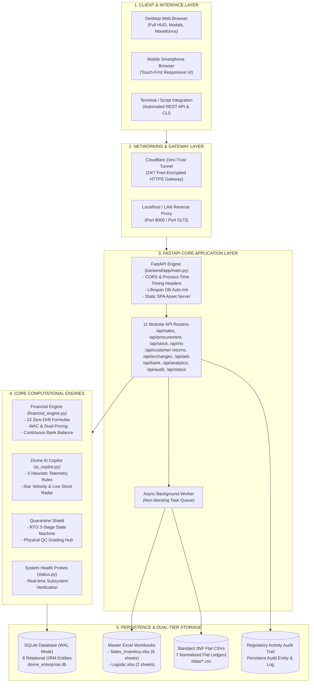
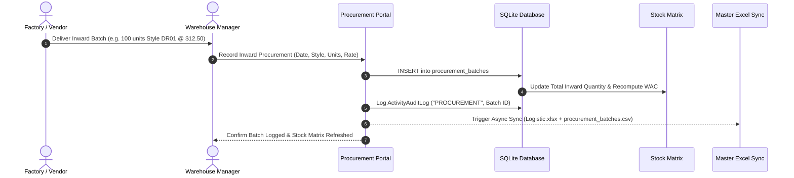
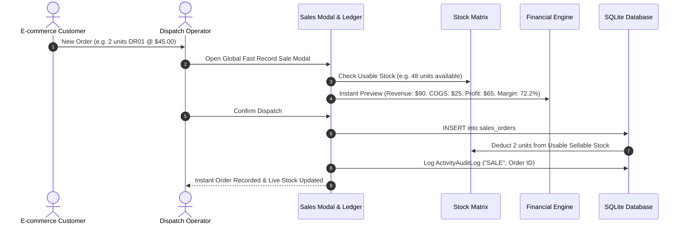
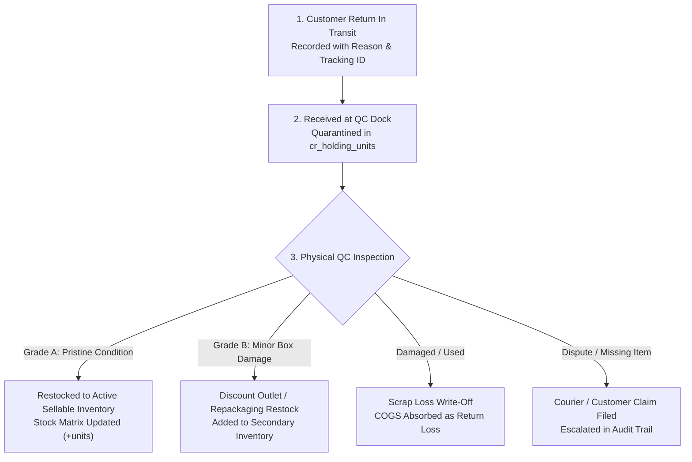

# Divine Enterprise ERP & Financial Intelligence Platform

[](https://www.python.org/)
[](https://fastapi.tiangolo.com/)
[](https://react.dev/)
[](https://vitejs.dev/)
[](https://www.sqlite.org/)
[](https://www.docker.com/)
[](https://www.cloudflare.com/)
[](#-system-health-diagnostics--endpoints)

> **Autonomous Enterprise Resource Planning, Inventory, Logistics & Financial Intelligence Suite**
> Engineered specifically for apparel, fashion retail, and multi-channel e-commerce operations. Unifies procurement, order fulfillment, reverse logistics quarantine, advertising attribution, bank treasury, and zero-drift financial reconciliation into an always-on, non-volatile architecture.

---

## ⚡ Quick Links & Live URL Directory

> [!IMPORTANT]
> ### 🔗 Permanent Fixed Access Links (Never Change)
>
> | Portal | Permanent URL |
> | :--- | :--- |
> | **Main Web App HUD** | 👉 [https://blurred-submerge-underuse.ngrok-free.dev](https://blurred-submerge-underuse.ngrok-free.dev/) |
> | **System Status & Diagnostics** | 👉 [https://blurred-submerge-underuse.ngrok-free.dev/status](https://blurred-submerge-underuse.ngrok-free.dev/status) |
> | **Direct In-App Status Tab** | 👉 [https://blurred-submerge-underuse.ngrok-free.dev/?tab=status](https://blurred-submerge-underuse.ngrok-free.dev/?tab=status) |

### 🌐 Web Interfaces & Dashboards

| Service / Interface | Localhost (LAN) URL | Permanent Fixed URL (Ngrok) | Temporary Cloudflare URL | Description |
| :--- | :--- | :--- | :--- | :--- |
| **Integrated Web App HUD** | [`http://localhost:8000`](http://localhost:8000) | [https://blurred-submerge-underuse.ngrok-free.dev](https://blurred-submerge-underuse.ngrok-free.dev) | [Quick Cloudflare Tunnel](https://range-holdem-kind-ventures.trycloudflare.com) | Primary executive portal: Sales, Inventory, RTO, Ads, Treasury & Analytics. |
| **Dedicated Status Dashboard** | [`http://localhost:8000/status`](http://localhost:8000/status) | [https://blurred-submerge-underuse.ngrok-free.dev/status](https://blurred-submerge-underuse.ngrok-free.dev/status) | [Cloudflare /status](https://range-holdem-kind-ventures.trycloudflare.com/status) | Standalone dark-mode telemetry dashboard displaying all 6 subsystem checks. |
| **In-App Health & Status Tab** | [`http://localhost:8000/?tab=status`](http://localhost:8000/?tab=status) | [https://blurred-submerge-underuse.ngrok-free.dev/?tab=status](https://blurred-submerge-underuse.ngrok-free.dev/?tab=status) | [Cloudflare Tab](https://range-holdem-kind-ventures.trycloudflare.com/?tab=status) | Direct link to the System Health tab embedded inside the full web app HUD. |
| **Vite Frontend Dev Server** | [`http://localhost:5173`](http://localhost:5173) | *Local Dev Only* | *Local Dev Only* | Hot-reloading React developer server with instant code refresh. |

### 📡 API & Diagnostic Endpoints

| API Endpoint                          | Method | Format | Full URL                                                                | Description                                                                       |
| :------------------------------------ | :-----: | :----: | :---------------------------------------------------------------------- | :-------------------------------------------------------------------------------- |
| **System Status JSON API**      | `GET` |  JSON  | [`http://localhost:8000/api/status`](http://localhost:8000/api/status) | Real-time diagnostic telemetry, RAM usage, ping latency, and table record counts. |
| **Interactive Swagger UI**      | `GET` |  HTML  | [`http://localhost:8000/docs`](http://localhost:8000/docs)             | Interactive API documentation to execute and test all 11 REST API routers.        |
| **ReDoc OpenAPI Documentation** | `GET` |  HTML  | [`http://localhost:8000/redoc`](http://localhost:8000/redoc)           | Clean, readable reference documentation for all REST API endpoints.               |
| **Liveness Health Probe**       | `GET` |  JSON  | [`http://localhost:8000/health`](http://localhost:8000/health)         | Lightweight 200 OK health check probe for Docker, Kubernetes, and uptime bots.    |

### 📁 Core Files & Workbooks

| Resource                                         | File Link                                                                                   | Purpose                                                                                |
| :----------------------------------------------- | :------------------------------------------------------------------------------------------ | :------------------------------------------------------------------------------------- |
| **Master Sales & Inventory Workbook**      | [`Sales_Inventory.xlsx`](<file:///d:/Business%20Website/Sales_Inventory.xlsx>)             | 9-sheet master workbook (Sales, Stock, RTO, Returns, Exchanges, Ads, Bank, Summaries). |
| **Master Sourcing & Procurement Workbook** | [`Logistic.xlsx`](<file:///d:/Business%20Website/Logistic.xlsx>)                           | 2-sheet master procurement and supply batch ledger.                                    |
| **Standard 3NF Flat CSV Directory**        | [`data/`](<file:///d:/Business%20Website/data>)                                            | 7 normalized flat CSV ledgers auto-synchronized with every mutation.                   |
| **Windows 1-Click Launch Script**          | [`deploy/run_dev.bat`](<file:///d:/Business%20Website/deploy/run_dev.bat>)                 | Starts database verification and launches the backend on port 8000.                    |
| **Linux/macOS 1-Click Launch Script**      | [`deploy/run_dev.sh`](<file:///d:/Business%20Website/deploy/run_dev.sh>)                   | Executable bash script to start the platform on Unix systems.                          |
| **Automated Database Backup Utility**      | [`deploy/backup_data.py`](<file:///d:/Business%20Website/deploy/backup_data.py>)           | Captures hot SQLite snapshots and creates zip archives with 30-day retention.          |
| **Portable Cloudflare Tunnel Binary**      | [`deploy/bin/cloudflared.exe`](<file:///d:/Business%20Website/deploy/bin/cloudflared.exe>) | Portable zero-config binary for 24/7 remote smartphone access.                         |

---

## ⚡ 1-Minute Quickstart: How to Run the Platform

Choose your preferred way to start the system:

### Option A: The Fastest Way (1-Click Run Script)

* **On Windows**: Double-click [`deploy/run_dev.bat`](<file:///d:/Business%20Website/deploy/run_dev.bat>) or run in terminal:
  ```bat
  deploy\run_dev.bat
  ```
* **On Linux / macOS**:
  ```bash
  chmod +x deploy/run_dev.sh && ./deploy/run_dev.sh
  ```
* Once started, open **`http://localhost:8000`** in any web browser!

### Option B: Run Backend & Frontend in Developer Mode (Hot Reload)

If you want to edit code and see instant updates:

```bash
# Terminal 1 - Backend API (port 8000)
.\.venv\Scripts\activate
python -m uvicorn backend.app.main:app --host 127.0.0.1 --port 8000 --reload

# Terminal 2 - Frontend Dev HUD (port 5173)
cd frontend
npm run dev
```

* Open **`http://localhost:5173`** for hot-reloading frontend development.

### Option C: Run 24/7 Mobile Remote Access via Permanent Fixed URL (Ngrok)
To launch your website with your **permanent, fixed link that never changes**:
* Simply double-click **[`deploy/run_with_fixed_url.bat`](file:///d:/Business%20Website/deploy/run_with_fixed_url.bat)**!
* Your permanent address is:  
  👉 **`https://blurred-submerge-underuse.ngrok-free.dev`**

### Option D: Run via Zero-Config Cloudflare Tunnel (Temporary Link)
If you prefer Cloudflare without registering an account:
* Double-click **[`deploy/run_with_tunnel.bat`](file:///d:/Business%20Website/deploy/run_with_tunnel.bat)**.
* Cloudflare provides a randomly generated public HTTPS URL on each run (e.g. `https://xxxx.trycloudflare.com`).

### Option E: Run with Docker Compose

```bash
docker compose up -d --build
```

* Container mounts `./data` to protect all data permanently. Live at **`http://localhost:8000`**.

---

## 📑 Table of Contents

1. [Quick Links &amp; Live URL Directory](#-quick-links--live-url-directory)
2. [1-Minute Quickstart: How to Run the Platform](#-1-minute-quickstart-how-to-run-the-platform)
3. [Executive Summary &amp; Problem Statement](#-executive-summary--problem-statement)
4. [Core Architectural Principles](#-core-architectural-principles)
5. [System Architecture &amp; Data Topology](#-system-architecture--data-topology)
6. [Subsystems &amp; Operational Flows](#-subsystems--operational-flows)
   - [Flow 1: Procurement &amp; Supply Intake](#flow-1-procurement--supply-intake)
   - [Flow 2: Order Fulfillment &amp; Sales Dispatch](#flow-2-order-fulfillment--sales-dispatch)
   - [Flow 3: Courier RTO (Return to Origin) 3-Stage Pipeline](#flow-3-courier-rto-return-to-origin-3-stage-pipeline)
   - [Flow 4: Customer Returns &amp; QC Grading Hub](#flow-4-customer-returns--qc-grading-hub)
   - [Flow 5: Item Exchanges &amp; Replacement Swaps](#flow-5-item-exchanges--replacement-swaps)
   - [Flow 6: Treasury &amp; Bank Reconciliation](#flow-6-treasury--bank-reconciliation)
   - [Flow 7: Marketing Attribution &amp; Blended ROAS](#flow-7-marketing-attribution--blended-roas)
   - [Flow 8: Dual-Tier Excel &amp; 3NF CSV Synchronization](#flow-8-dual-tier-excel--3nf-csv-synchronization)
   - [Flow 9: System Health &amp; Multi-Subsystem Diagnostics](#flow-9-system-health--multi-subsystem-diagnostics)
   - [Flow 10: Zero-Cost 24/7 Remote Mobile Access](#flow-10-zero-cost-247-remote-mobile-access)
7. [Financial Mathematics &amp; Calculation Engine (23 Formulas)](#-financial-mathematics--calculation-engine-23-formulas)
8. [Divine AI Copilot Engine (5 Heuristic Rules)](#-divine-ai-copilot-engine-5-heuristic-rules)
9. [Database Schema &amp; ORM Entities](#-database-schema--orm-entities)
10. [Project Structure &amp; Codebase Map](#-project-structure--codebase-map)
11. [Comprehensive Installation, Setup &amp; Deployment Guide](#-installation-setup--how-to-run)
    - [Prerequisites](#prerequisites)
    - [Method 1: Native Local Runner (Quickstart)](#method-1-native-local-runner-quickstart)
    - [Method 2: Developer Mode (Hot-Reloading)](#method-2-developer-mode-hot-reloading)
    - [Method 3: Multi-Stage Production Docker](#method-3-multi-stage-production-docker)
    - [Method 4: Zero-Cost 24/7 Cloudflare Tunnel (Remote Mobile Phone)](#method-4-zero-cost-247-cloudflare-tunnel-remote-mobile-phone)
    - [Method 5: Cloud Hosting (Render / Railway / VPS)](#method-5-cloud-hosting-render--railway--vps)
12. [System Health Diagnostics &amp; Endpoints Reference](#-system-health-diagnostics--endpoints)
13. [Management, Operations &amp; Disaster Recovery](#-management-operations--disaster-recovery)
14. [Testing, Verification &amp; Quality Assurance](#-testing-verification--quality-assurance)

---

## 🎯 Executive Summary & Problem Statement

### The Problem with Traditional Spreadsheets

Fast-moving e-commerce retail businesses frequently run on standalone spreadsheets (`Sales_Inventory.xlsx` and `Logistic.xlsx`). While flexible, this approach inevitably collapses under scaling operations:

* **File-Lock Contention**: When multiple staff open or edit workbooks simultaneously, Excel locks files, causing write collisions and corrupted data.
* **Phantom Sellable Stock**: When customer returns or undelivered courier parcels (RTOs) arrive at the warehouse, staff either prematurely re-add uninspected units to active stock (selling damaged goods) or fail to record them altogether (tying up capital).
* **Financial Formula Drift**: Rounding errors between unit prices and total invoice amounts result in penny drift between sales ledgers, bank balances, and tax filings.
* **Lack of Regulatory Audit Trail**: Uncontrolled edits, deleted rows, and missing timestamps make it impossible to audit past operational mutations.

### The Unified Solution

**Divine Enterprise ERP** solves these operational bottlenecks by pairing a high-concurrency **FastAPI backend** and **SQLite WAL-mode relational database** with an **automatic bidirectional Excel & CSV engine**.

* Operators enjoy a blisteringly fast, responsive **React 18 HUD** on desktop and mobile.
* Non-technical stakeholders and accountants can continue reading, sharing, and archiving standard **9-sheet Master Excel workbooks** (`Sales_Inventory.xlsx` & `Logistic.xlsx`) and normalized **3NF flat CSV ledgers**.
* Every mutation triggers zero-drift mathematical reconciliation and is permanently recorded in a cryptographic-ready **activity audit trail**.

---

## 🏛️ Core Architectural Principles

1. **Non-Volatile Dual-Tier Persistence**:
   Every operational mutation (sale, return, purchase, ad expense, bank transaction) writes instantaneously to SQLite with Write-Ahead Logging (`WAL`). An asynchronous background worker then updates the 9-sheet master Excel workbooks and 7 normalized 3NF CSV files with atomic file-flushing.
2. **Quarantine-First Reverse Logistics**:
   Courier undelivered items (RTO) and customer return shipments are **strictly barred** from sellable inventory. Items must progress through physical dock receipt, QC grading, and manual operator approval before restock or scrap write-off.
3. **Zero-Drift Bidirectional Financial Precision**:
   Transactions accept either unit price or total invoice revenue, auto-computing exact bidirectional values to eliminate penny rounding errors across thousands of transactions.
4. **Resilient Local & Remote Multi-Access**:
   Supports native local LAN desktop operations, terminal CLI scripts, and 24/7 encrypted remote access from smartphones over public HTTPS without paid servers or static IPs.
5. **Multi-Subsystem Telemetry Probing**:
   Continuous automated self-inspection validates API uptime, database connectivity, 8 table counts, file sizes, Excel sheet schemas, and mathematical accounting identities.

---

## 🌐 System Architecture & Data Topology



---

## 🔄 Subsystems & Operational Flows

### Flow 1: Procurement & Supply Intake



---

### Flow 2: Order Fulfillment & Sales Dispatch



---

### Flow 3: Courier RTO (Return to Origin) 3-Stage Pipeline

*Courier returns (undelivered / customer refused COD) must never immediately enter active inventory.*

```
[ Stage 1: IN_TRANSIT ]
  - Courier marks package non-delivered.
  - Recorded in RTO Pipeline.
  - Active sellable stock is NOT touched.
       │
       ▼ (Parcel arrives at warehouse dock)
[ Stage 2: RECEIVED (Quarantined) ]
  - Warehouse scans barcode & clicks "Receive".
  - Units enter Protected RTO Dock Holding Buffer.
  - Physical package is unboxed & inspected.
       │
       ├────────────────────────────────────────┐
       ▼ (Item in pristine condition)           ▼ (Item damaged / lost)
[ Stage 3a: RESTOCKED ]                  [ Stage 3b: DAMAGED / SCRAP ]
  - Operator clicks "Restock".             - Operator clicks "Damage".
  - Stock Matrix: Usable Stock +1.         - Marked as inventory loss write-off.
  - Cleared from Quarantine Dock.          - Stock is NOT credited.
```

---

### Flow 4: Customer Returns & QC Grading Hub

*Delivered items returned by customers require rigorous physical QC inspection.*



---

### Flow 5: Item Exchanges & Replacement Swaps

An exchange requires a synchronized **two-legged inventory transaction**:

1. **Replacement Item Outflow**: Deducts the newly requested replacement unit from active stock immediately to fulfill the replacement order.
2. **Original Item Inflow & Quarantine**: Places the inbound returned item into the exchange staging buffer until physically verified, inspected, and restocked.

---

### Flow 6: Treasury & Bank Reconciliation

Provides continuous reconciliation between bank statements and ERP transaction flows:

* **Credit Entries (+)**: Customer prepaid remittances, COD courier cash disbursements, owner capital injections.
* **Debit Entries (-)**: Supplier procurement payments, advertising invoices, logistics shipping charges, facility overhead.
* **Continuous Running Balance**: Recalculates exact closing balance with zero rounding drift:
  $$
  \text{Running Balance} = \sum \text{Credits} - \sum \text{Debits}
  $$

---

### Flow 7: Marketing Attribution & Blended ROAS

Tracks ad spend across channels (Meta Ads, Google Ads, TikTok, Influencers):

* **Blended ROAS Calculation**:
  $$
  \text{Blended ROAS} = \frac{\text{Total System Revenue}}{\text{Total Advertising Spend}}
  $$
* **ROAS Performance Tiers**:
  * $\ge 4.0\times$: **Exceptional** (Green) — Scale spend aggressively.
  * $2.5\times - 3.99\times$: **Profitable** (Blue) — Sustainable growth.
  * $1.5\times - 2.49\times$: **Marginal** (Yellow) — Monitor product margins closely.
  * $< 1.5\times$: **Sub-threshold** (Red) — Cut underperforming ad sets immediately.

---

### Flow 8: Dual-Tier Excel & 3NF CSV Synchronization

To prevent file-locking crashes when users open spreadsheets in Microsoft Excel, the synchronization engine leverages non-blocking asynchronous workers:

```
FastAPI Mutation (Sale, RTO, Procurement, Bank)
       │
       ▼
1. Commit to SQLite (divine_enterprise.db) with WAL journal mode (< 5ms)
       │
       ▼
2. Trigger FastAPI BackgroundTask (Non-blocking response to user)
       │
       ▼
3. Excel & CSV Sync Worker (excel_sync.py)
   ├── Load ORM entities
   ├── Regenerate 9 formatted sheets in Sales_Inventory.xlsx
   ├── Regenerate 2 sheets in Logistic.xlsx
   ├── Atomically flush 7 flat 3NF CSVs in data/
   └── If file is locked by Excel: Exponential backoff retry (0.5s, 1s, 2s)
```

---

### Flow 9: System Health & Multi-Subsystem Diagnostics

*Real-time probe accessible at `/status` (HTML Dashboard) and `/api/status` (JSON API).*

The diagnostic engine automatically runs 6 comprehensive tests:

1. **API Runtime Probe**: Validates uptime, RAM usage (RSS), PID, Python runtime, and diagnostic latency.
2. **SQLite Database Probe**: Pings the DB (`SELECT 1`), measures latency in ms, verifies DB file size on disk, and counts records across all 8 relational tables.
3. **Master Excel Workbooks Probe**: Verifies existence, byte sizes, and sheet tab integrity for `Sales_Inventory.xlsx` and `Logistic.xlsx`.
4. **Standard 3NF CSV Ledgers Probe**: Confirms existence and row counts of all 7 CSV files in `data/`.
5. **Zero-Drift Financial Identity Probe**: Re-validates the mathematical identity $\text{Gross Profit} \equiv \text{Revenue} - \text{COGS}$, checks realized revenue bounds, and verifies bank continuous balance matching.
6. **Quarantine Buffer Probe**: Measures units held in courier RTO docks, customer return intake, and exchange buffers to ensure sellable inventory is 100% protected.

---

### Flow 10: Zero-Cost 24/7 Remote Mobile Access

Allows store managers and business owners to securely monitor and manage operations from their mobile smartphones 24/7 without paid cloud hosting or static IPs:

```
[ Smartphone on 5G / Wi-Fi anywhere in the world ]
       │  (Encrypted HTTPS)
       ▼
[ Cloudflare Global Edge Network ]
       │  (Secure Zero-Trust Tunnel)
       ▼
[ cloudflared.exe Daemon running locally ]
       │  (Forwarding traffic over localhost)
       ▼
[ FastAPI Server on port 8000 ]
       ├── Serves pre-compiled React 18 HUD
       └── Executes SQLite & Excel sync operations
```

---

## 🧮 Financial Mathematics & Calculation Engine (23 Formulas)

Every metric in Divine Enterprise ERP is governed by strict mathematical specifications implemented in [`backend/app/services/financial_engine.py`](<file:///d:/Business%20Website/backend/app/services/financial_engine.py>):

| No. | Metric Name | Mathematical Specification | Business Significance |
| :--- | :--- | :--- | :--- |
| **1** | **Total Inward Units** | $S_{\text{inward}} = \sum \text{Units}_{\text{procured}}$ | Gross physical inventory ever procured. |
| **2** | **Total Dispatched Units** | $S_{\text{dispatched}} = \sum \text{Units}_{\text{sold}}$ | Gross units dispatched across all orders. |
| **3** | **Total Restocked Units** | $S_{\text{restocked}} = S_{\text{rto}} + S_{\text{returns}} + S_{\text{exchanges}}$ | Units returned, inspected, and approved back into stock. |
| **4** | **Usable Sellable Stock** | $S_{\text{usable}} = S_{\text{inward}} - S_{\text{dispatched}} + S_{\text{restocked}}$ | **The single true source of sellable stock**. Prevents phantom overselling. |
| **5** | **RTO Quarantine Units** | $S_{\text{rto-hold}} = \sum \text{Units}_{\text{received}}$ | Undelivered parcels received at dock; strictly un-sellable. |
| **6** | **Customer Return Quarantine** | $S_{\text{cr-hold}} = \sum \text{Units}_{\text{received}}$ | Customer returns undergoing physical QC inspection. |
| **7** | **Exchange Intake Quarantine** | $S_{\text{exch-hold}} = \sum \text{Units}_{\text{received}}$ | Inbound swap units awaiting QC and restocking. |
| **8** | **Total Quarantine Buffer** | $S_{\text{quarantine}} = S_{\text{rto-hold}} + S_{\text{cr-hold}} + S_{\text{exch-hold}}$ | Total units protected from accidental dispatch. |
| **9** | **Weighted Average Cost (WAC)** | $\text{WAC} = \frac{\sum (\text{Units}_i \times \text{Rate}_i)}{\sum \text{Units}_i}$ | Blended cost per unit across multiple procurement batches. |
| **10** | **Inventory Valuation (WAC)** | $V_{\text{inventory}} = S_{\text{usable}} \times \text{WAC}$ | True monetary value of active sellable stock. |
| **11** | **Dual-Pricing Resolution** | $\text{Revenue} = \text{Invoice Total} \text{ or } (\text{Qty} \times \text{Price})$ | Eliminates penny drift across split wholesale invoices. |
| **12** | **Total Dispatched Revenue** | $R_{\text{gross}} = \sum \text{Revenue}_{\text{sales}}$ | Gross value of all merchandise dispatched. |
| **13** | **Total COGS** | $\text{COGS}_{\text{gross}} = \sum \text{COGS}_{\text{sales}}$ | Purchase cost of all dispatched merchandise. |
| **14** | **Gross Profit** | $\text{GP} = R_{\text{gross}} - \text{COGS}_{\text{gross}}$ | Core operating margin before overhead. |
| **15** | **Gross Profit Margin %** | $\text{Margin}_{\text{GP}} = \frac{\text{GP}}{R_{\text{gross}}} \times 100$ | Unit operational profitability ratio. |
| **16** | **Adjusted Realized Revenue** | $R_{\text{adj}} = R_{\text{gross}} - (R_{\text{rto}} + R_{\text{returns}})$ | Cash expected from successfully delivered orders. |
| **17** | **Net Realized Profit (5-Tier)** | $\text{NP} = \text{GP} - \text{Loss}_{\text{rto}} - \text{Loss}_{\text{returns}} - \text{Spend}_{\text{ads}} - \text{Expenses}$ | **True net cash profit** after returns and marketing costs. |
| **18** | **RTO Damage Loss Rate %** | $\text{Rate}_{\text{rto-dmg}} = \frac{S_{\text{rto-damaged}}}{S_{\text{rto-total}}} \times 100$ | Courier handling damage benchmark. |
| **19** | **Customer Return Loss Rate %** | $\text{Rate}_{\text{cr-dmg}} = \frac{S_{\text{cr-damaged}}}{S_{\text{cr-total}}} \times 100$ | Defect / customer wear scrap percentage. |
| **20** | **Delivery Success Rate %** | $\text{Rate}_{\text{success}} = \frac{S_{\text{dispatched}} - (S_{\text{rto}} + S_{\text{returns}})}{S_{\text{dispatched}}} \times 100$ | Percentage of shipped parcels generating settled cash. |
| **21** | **Continuous Bank Balance** | $\text{Balance} = \sum \text{Credits} - \sum \text{Debits}$ | Exact running treasury cash balance. |
| **22** | **Blended Marketing ROAS** | $\text{ROAS} = \frac{R_{\text{gross}}}{\text{Total Ad Spend}}$ | Return on ad spend across all digital channels. |
| **23** | **4-Tier Stock Health Status** | Star ($\ge 30$) \| Adequate ($10-29$) \| Low ($1-9$) \| Depleted ($0$) | Live replenishment and inventory warning classification. |

---

## 🤖 Divine AI Copilot Engine (5 Heuristic Rules)

Implemented in [`backend/app/services/ai_copilot.py`](<file:///d:/Business%20Website/backend/app/services/ai_copilot.py>), the copilot monitors real-time transaction telemetry to deliver proactive business guidance:

```
                                  [ Divine AI Copilot Engine ]
                                                │
         ┌──────────────────┬───────────────────┼───────────────────┬──────────────────┐
         ▼                  ▼                   ▼                   ▼                  ▼
     [ RULE 1 ]         [ RULE 2 ]          [ RULE 3 ]          [ RULE 4 ]         [ RULE 5 ]
   Star Performer     Low Stock Radar       Marketing ROAS      Quarantine Dock     Margin & Sync
   Velocity Tracker   & Runway Alert        Efficiency Tiers    Restock Triggers    Zero-Drift Monitor
```

1. **Rule 1: Star Performer Velocity Tracker**:
   Identifies styles generating top 25% order volume with healthy profit margins ($\ge 45\%$). Recommends procurement scale-up before stockouts occur.
2. **Rule 2: Low Stock Runway Alert**:
   Calculates daily sales velocity against active sellable units. Triggers amber warnings when runway drops below 5 days and critical red alerts on zero stock.
3. **Rule 3: Marketing ROAS Efficiency Tiers**:
   Evaluates blended ROAS across 4 performance tiers ($< 1.5\times$ through $\ge 4.0\times$), guiding operators on when to scale ad budgets or prune unprofitable campaigns.
4. **Rule 4: Quarantine Dock Restock Unlock Trigger**:
   Monitors units sitting idle on the RTO and Customer Return intake docks. Triggers automated notifications to warehouse staff when received units are ready for QC grading and restock.
5. **Rule 5: Margin Velocity & Ledger Sync Monitor**:
   Monitors gross margins against baseline targets and audits background synchronization latency to guarantee zero discrepancy between SQLite and Excel files.

---

## 🗄️ Database Schema & ORM Entities

The system uses SQLAlchemy 2.0 ORM models in [`backend/app/models/entities.py`](<file:///d:/Business%20Website/backend/app/models/entities.py>) mapped to SQLite tables:

```
┌─────────────────────────┐       ┌─────────────────────────┐
│   procurement_batches   │       │      sales_orders       │
├─────────────────────────┤       ├─────────────────────────┤
│ id (PK, Integer)        │       │ id (PK, Integer)        │
│ date (String)           │       │ date (String)           │
│ style_no (String, IDX)  │──┐ ┌──│ style_no (String, IDX)  │
│ inventory (Integer)     │  │ │  │ quantity_sold (Integer) │
│ purchase_rate (Float)   │  │ │  │ selling_price (Float)   │
│ total_value (Float)     │  │ │  │ total_revenue (Float)   │
└─────────────────────────┘  │ │  │ cogs (Float)            │
                             │ │  │ profit (Float)          │
┌─────────────────────────┐  │ │  │ profit_margin (Float)   │
│      rto_pipeline       │  │ │  └─────────────────────────┘
├─────────────────────────┤  │ │  
│ id (PK, Integer)        │  │ │  ┌─────────────────────────┐
│ order_id / awb (String) │  │ │  │    customer_returns     │
│ style_no (String, IDX)  │──┤ │  ├─────────────────────────┤
│ units (Integer)         │  │ │  │ id (PK, Integer)        │
│ status (IN_TRANSIT,     │  │ └──│ style_no (String, IDX)  │
│         RECEIVED,       │  │    │ units (Integer)         │
│         RESTOCKED,      │  │    │ qc_grade (Grade A/B/Dmg)│
│         DAMAGED)        │  │    │ status (String)         │
└─────────────────────────┘  │    └─────────────────────────┘
                             │  
┌─────────────────────────┐  │    ┌─────────────────────────┐
│     item_exchanges      │  │    │        ad_spends        │
├─────────────────────────┤  │    ├─────────────────────────┤
│ id (PK, Integer)        │  │    │ id (PK, Integer)        │
│ original_style (String) │──┘    │ date (String)           │
│ new_style (String)      │       │ platform (Meta/Google)  │
│ status (String)         │       │ amount (Float)          │
└─────────────────────────┘       └─────────────────────────┘
                           
┌─────────────────────────┐       ┌─────────────────────────┐
│    bank_transactions    │       │   activity_audit_logs   │
├─────────────────────────┤       ├─────────────────────────┤
│ id (PK, Integer)        │       │ id (PK, Integer)        │
│ date (String)           │       │ timestamp (DateTime)    │
│ description (String)    │       │ category (SALE/RTO/etc) │
│ type (Credit / Debit)   │       │ action (INSERT/UPDATE)  │
│ amount (Float)          │       │ details (JSON Text)     │
│ balance (Float)         │       │ status (SUCCESS/WARN)   │
└─────────────────────────┘       └─────────────────────────┘
```

---

## 📂 Project Structure & Codebase Map

```
d:/Business Website/
├── README.md                           # Master Architecture, Flow & Operations Guide (This file)
├── Dockerfile                          # Multi-stage production container (Node 20 + Python 3.11)
├── docker-compose.yml                  # 1-command container orchestration with persistent data volume
├── Sales_Inventory.xlsx                # 9-sheet Master Sales, Inventory, RTO, Ads & Bank Workbook
├── Logistic.xlsx                       # 2-sheet Sourcing & Procurement Master Workbook
├── TASKS.md                            # Comprehensive 38-step implementation & verification roadmap
│
├── backend/                            # FastAPI Python Backend Application
│   ├── requirements.txt                # Production dependencies (fastapi, uvicorn, openpyxl, sqlalchemy)
│   ├── app/
│   │   ├── main.py                     # ASGI application entrypoint, CORS, static mounting & routes
│   │   ├── db/
│   │   │   ├── session.py              # SQLite engine configuration (WAL mode) & session lifecycle
│   │   │   └── init_db.py              # Schema generation & cold-start Excel seed data ingestion
│   │   ├── models/
│   │   │   └── entities.py             # 8 SQLAlchemy 2.0 ORM entity definitions
│   │   ├── schemas/
│   │   │   └── dtos.py                 # Pydantic v2 validation schemas for REST payloads
│   │   ├── services/
│   │   │   ├── financial_engine.py     # 23 zero-drift financial formulas & metric calculators
│   │   │   ├── ai_copilot.py           # 5 heuristic business telemetry rules & recommendation engine
│   │   │   └── excel_sync.py           # Bidirectional sync engine (SQLite ⇄ OpenPyXL ⇄ 3NF CSVs)
│   │   └── api/                        # 11 Modular REST API Routers
│   │       ├── procurement.py          # Sourcing & inward batch management
│   │       ├── sales.py                # Sales order creation, stock deduction & fast preview
│   │       ├── stock.py                # Stock balance matrix query & manual sync trigger
│   │       ├── rto.py                  # Courier RTO 3-stage pipeline transitions & bulk restock
│   │       ├── customer_returns.py     # Returns intake, QC grading (Grade A/B/Damage), bulk restock
│   │       ├── exchanges.py            # Item swaps, replacement deduction, dock restock
│   │       ├── ads.py                  # Advertising spend logging & channel attribution
│   │       ├── bank.py                 # Bank credit/debit entries & continuous running balance
│   │       ├── analytics.py            # KPI cards, trend waveforms (7D, 30D, ALL), copilot insights
│   │       ├── audit.py                # Regulatory activity audit trail queries, CSV export & archive
│   │       └── status.py               # Real-time System Health & Subsystem Diagnostics Engine
│   └── tests/                          # Automated Pytest Test Suites
│       ├── test_api_routes.py          # Integration tests for all REST endpoints
│       ├── test_excel_sync.py          # Parity tests for Excel & CSV export consistency
│       └── test_financial_engine.py    # Zero-drift mathematical precision verification
│
├── frontend/                           # React 18 + Vite + TailwindCSS Frontend Application
│   ├── package.json                    # Dependencies (Lucide icons, Tailwind, SheetJS)
│   ├── vite.config.js                  # Vite bundler configuration & local dev server proxy
│   ├── dist/                           # Compiled production static bundle (served by FastAPI)
│   └── src/
│       ├── App.jsx                     # Root application shell, tab routing & modal controller
│       ├── components/
│       │   ├── Sidebar.jsx             # Responsive dockable sidebar with live badges & WAL indicator
│       │   └── TopBar.jsx              # Command HUD, sync trigger & master Excel export button
│       ├── views/                      # 12 Modular Operational Views
│       │   ├── DashboardView.jsx       # Executive KPI cards, waveform charts, copilot alert banner
│       │   ├── SalesView.jsx           # Sales order ledger with style autocomplete & inline editing
│       │   ├── StockView.jsx           # Real-time stock matrix with 4-tier health status badges
│       │   ├── RTOView.jsx             # Courier RTO 3-stage pipeline & bulk restock buttons
│       │   ├── ReturnsView.jsx         # Customer returns with physical QC grading modal
│       │   ├── ExchangesView.jsx       # Replacement swaps & reverse intake buffer
│       │   ├── ProcurementView.jsx     # Factory sourcing batches & purchase cost tracking
│       │   ├── AdsView.jsx             # Marketing campaign spend & blended ROAS analytics
│       │   ├── BankView.jsx            # Treasury credit/debit register & continuous running balance
│       │   ├── AnalyticsView.jsx       # Daily sales & ad spend tables with gross margin trends
│       │   ├── AuditView.jsx           # Live regulatory event trail with category filtering & CSV export
│       │   ├── StatusView.jsx          # Live System Health Dashboard with subsystem probe cards
│       │   └── TasksView.jsx           # Interactive 38/38 verified tasks & delivery checklist
│       ├── modals/                     # Fast Data-Entry & QC Modals
│       │   └── GlobalRecordSaleModal.jsx # Quick order dispatcher with live stock & markup preview
│       ├── services/
│       │   └── api.js                  # Unified Axios/Fetch API client for all backend endpoints
│       └── utils/
│           └── exportUtils.js          # SheetJS client-side master Excel workbook generation
│
├── data/                               # Standardized 3NF Flat CSV Ledgers (Auto-synchronized)
│   ├── procurement_batches.csv
│   ├── sales_orders.csv
│   ├── rto_pipeline.csv
│   ├── customer_returns.csv
│   ├── item_exchanges.csv
│   ├── ad_spends.csv
│   └── bank_transactions.csv
│
└── deploy/                             # Production Deployment Runbooks & Utilities
    ├── bin/
    │   └── cloudflared.exe             # Portable Cloudflare Zero-Trust Tunnel executable
    ├── run_dev.bat                     # 1-click Windows native launch script
    ├── run_dev.sh                      # 1-click Linux/macOS native launch script
    ├── backup_data.py                  # Automated SQLite Online Backup & zip retention pruner
    ├── render.yaml                     # Render.com Blueprint configuration
    ├── deploy_render.md                # Step-by-step guide for Render deployment
    ├── deploy_railway.md               # Step-by-step guide for Railway deployment
    ├── deploy_vps.md                   # VPS guide with systemd and Caddy HTTPS
    ├── Caddyfile                       # Automatic SSL reverse proxy configuration
    └── enterprise-ops.service          # Linux systemd daemon service definition
```

---

## 🚀 Installation, Setup & How to Run

### Prerequisites

* **Python**: `3.11`, `3.12`, `3.13`, or `3.14`
* **Node.js**: `v18.0.0` or higher & `npm` (for building the frontend)
* **Operating System**: Windows 10/11, macOS, or Linux

---

### Method 1: Native Local Runner (Quickstart)

The simplest way to start the system locally on your workstation:

#### On Windows:

Double-click [`deploy/run_dev.bat`](<file:///d:/Business%20Website/deploy/run_dev.bat>) or run in PowerShell / Command Prompt:

```bat
deploy\run_dev.bat
```

#### On Linux / macOS:

```bash
chmod +x deploy/run_dev.sh
./deploy/run_dev.sh
```

This script will automatically:

1. Activate your Python virtual environment (`.venv`).
2. Run database initialization and verify seed data (`backend.app.db.init_db`).
3. Start the production FastAPI application on `http://127.0.0.1:8000`.
4. Serve the compiled React web application, REST API, and System Status page.

---

### Method 2: Developer Mode (Hot-Reloading)

If you are developing features and want instant hot-reloading for both backend and frontend:

#### Terminal 1 — Start Backend Server:

```bash
# 1. Create and activate virtual environment
python -m venv .venv
# On Windows:
.\.venv\Scripts\activate
# On Linux/macOS:
source .venv/bin/activate

# 2. Install backend dependencies
pip install -r backend/requirements.txt

# 3. Start FastAPI server with live auto-reload
python -m uvicorn backend.app.main:app --host 127.0.0.1 --port 8000 --reload
```

* Backend API is live at: `http://127.0.0.1:8000`
* Interactive API Documentation: `http://127.0.0.1:8000/docs`

#### Terminal 2 — Start Frontend Dev Server:

```bash
cd frontend
npm install
npm run dev
```

* Frontend Hot-Reload HUD is live at: `http://localhost:5173`

---

### Method 3: Multi-Stage Production Docker

Deploy as a standalone, self-healing Docker container with persistent volumes:

```bash
# 1. Build and run container in detached mode
docker compose up -d --build

# 2. View container logs
docker compose logs -f

# 3. Stop container
docker compose down
```

The container automatically:

* Compiles the React frontend using a Node 20 Alpine builder.
* Bundles static assets into a slim Python 3.11 production container.
* Mounts `./data` to `/app/data` to ensure **zero data loss** across container restarts.
* Exposes the complete platform on `http://localhost:8000`.

---

### Method 4: Zero-Cost 24/7 Cloudflare Tunnel (Remote Mobile Phone)

> [!TIP]
> **No Paid Cloud Server or Static IP Required!**
> You can access your platform on your smartphone from anywhere in the world using the included, pre-configured portable Cloudflare Tunnel.

```bash
# Start the live encrypted public HTTPS tunnel:
deploy\bin\cloudflared.exe tunnel --url http://127.0.0.1:8000
```

Cloudflare will output a live HTTPS URL (for example):

```text
https://range-holdem-kind-ventures.trycloudflare.com
```

Open that URL on any mobile phone browser to monitor inventory, dispatch sales, inspect returns, or check system health.

---

### Method 5: Cloud Hosting (Render / Railway / VPS)

For full deployment runbooks on cloud providers, refer to the guides in [`deploy/`](<file:///d:/Business%20Website/deploy>):

* **Render.com**: Follow [`deploy/deploy_render.md`](<file:///d:/Business%20Website/deploy/deploy_render.md>) (uses included `render.yaml`).
* **Railway.app**: Follow [`deploy/deploy_railway.md`](<file:///d:/Business%20Website/deploy/deploy_railway.md>).
* **Linux VPS (Ubuntu / Debian)**: Follow [`deploy/deploy_vps.md`](<file:///d:/Business%20Website/deploy/deploy_vps.md>) (includes pre-configured `enterprise-ops.service` and `Caddyfile` for automated HTTPS).

---

## 🛡️ System Health Diagnostics & Endpoints Reference

The platform provides a dedicated health check and diagnostic system accessible via browser and API:

| URL Endpoint | Method | Format | Permanent Fixed URL (Ngrok) | Localhost Clickable URL | Purpose |
| :--- | :---: | :---: | :--- | :--- | :--- |
| **`/status`** | `GET` | HTML | [https://blurred-submerge-underuse.ngrok-free.dev/status](https://blurred-submerge-underuse.ngrok-free.dev/status) | [`http://localhost:8000/status`](http://localhost:8000/status) | **Dedicated Visual Status Dashboard**: Dark-mode telemetry monitor displaying real-time health across all 6 core subsystems. |
| **`/api/status`** | `GET` | JSON | [https://blurred-submerge-underuse.ngrok-free.dev/api/status](https://blurred-submerge-underuse.ngrok-free.dev/api/status) | [`http://localhost:8000/api/status`](http://localhost:8000/api/status) | **Raw JSON Diagnostics API**: Returns full telemetry data, memory stats, ping latencies, and table counts for monitoring tools. |
| **`/?tab=status`** | `GET` | React | [https://blurred-submerge-underuse.ngrok-free.dev/?tab=status](https://blurred-submerge-underuse.ngrok-free.dev/?tab=status) | [`http://localhost:8000/?tab=status`](http://localhost:8000/?tab=status) | **Integrated In-App HUD View**: Accessible directly via the sidebar under *Core Intelligence ➔ System Health & Checks*. |
| **`/health`** | `GET` | JSON | [https://blurred-submerge-underuse.ngrok-free.dev/health](https://blurred-submerge-underuse.ngrok-free.dev/health) | [`http://localhost:8000/health`](http://localhost:8000/health) | **Lightweight Liveness Probe**: Used by Docker, Kubernetes, and uptime checkers. |
| **`/docs`** | `GET` | HTML | [https://blurred-submerge-underuse.ngrok-free.dev/docs](https://blurred-submerge-underuse.ngrok-free.dev/docs) | [`http://localhost:8000/docs`](http://localhost:8000/docs) | **Interactive OpenAPI (Swagger) UI**: Full interactive API sandbox to test every endpoint. |

### Diagnostic Telemetry Output Example (`/api/status`):

```json
{
  "overall_status": "HEALTHY",
  "checks_passed": 6,
  "total_checks": 6,
  "diagnostic_latency_ms": 18.5,
  "api_service": {
    "status": "PASS",
    "service_name": "Divine Enterprise ERP Engine",
    "version": "2.4.0",
    "uptime_human": "2h 45m 12s",
    "memory_rss_mb": 54.2,
    "process_id": 36384,
    "python_version": "3.14.2"
  },
  "database": {
    "status": "PASS",
    "ping_latency_ms": 1.2,
    "file_size": "144.0 KB",
    "total_records": 178,
    "tables": {
      "procurement_batches": 43,
      "sales_orders": 66,
      "rto_pipeline": 10,
      "customer_returns": 5,
      "item_exchanges": 1,
      "ad_spends": 28,
      "bank_transactions": 11,
      "activity_audit_logs": 14
    }
  },
  "excel_workbooks": {
    "status": "PASS",
    "sales_inventory_workbook": { "exists": true, "sheet_count": 9 },
    "logistic_workbook": { "exists": true, "sheet_count": 2 }
  },
  "financial_engine": {
    "status": "PASS",
    "gross_profit_identity": { "verified": true },
    "bank_ledger_continuity": { "verified": true }
  },
  "quarantine_shield": {
    "status": "PASS",
    "total_quarantined_units": 16
  }
}
```

---

## 🛠️ Management, Operations & Disaster Recovery

### Daily Operational Routine

1. **Morning Intake**:
   * Record new factory deliveries in the **Procurement & POs** tab to inject stock and calculate WAC.
2. **Fulfillment**:
   * Click **Fast Record Sale** (or press `Alt + S`) to dispatch orders. Live stock balances and margins update instantaneously.
3. **Midday Reverse Logistics Check**:
   * Open **Courier RTO Dock** and **Customer Returns**. Scan delivered parcels, click **Received**, perform QC inspection, and either restock or record damage write-offs.
4. **Evening Financial Balancing**:
   * Log daily ad spend across channels in **Marketing & ROAS**.
   * Reconcile bank transactions in **Bank Treasury** to confirm cash ledger parity.
   * Check **System Health & Checks** (`/status`) to confirm all 6 diagnostic probes pass.

### Automated Backup & Disaster Recovery

A dedicated backup utility is included in [`deploy/backup_data.py`](<file:///d:/Business%20Website/deploy/backup_data.py>). It uses the **SQLite Online Backup API** to capture a hot snapshot without locking database writes:

```bash
# Run manual backup:
python deploy/backup_data.py
```

* Creates timestamped, zip-compressed archives in `deploy/backups/`.
* Includes `divine_enterprise.db`, `Sales_Inventory.xlsx`, `Logistic.xlsx`, and all CSVs in `data/`.
* Automatically prunes snapshots older than 30 days to optimize disk space.

---

## 🧪 Testing, Verification & Quality Assurance

The codebase includes an automated test suite verifying mathematical precision, API route contracts, and Excel synchronization consistency:

```bash
# Run the complete test suite with pytest:
pytest backend/tests/ -v
```

### Verified Test Results:

* `backend/tests/test_api_routes.py`: Verifies CRUD, stock deduction, and status transitions across all 11 API routers.
* `backend/tests/test_excel_sync.py`: Verifies that SQLite entity states match Excel workbooks and 3NF CSV files with zero missing rows.
* `backend/tests/test_financial_engine.py`: Verifies zero-drift mathematical accuracy across all 23 core financial formulas.

```text
============================= test session starts =============================
platform win32 -- Python 3.14.2, pytest-9.1.1, pluggy-1.6.0
collected 18 items

backend/tests/test_api_routes.py ..........                              [ 55%]
backend/tests/test_excel_sync.py ...                                     [ 72%]
backend/tests/test_financial_engine.py .....                             [100%]

======================= 18 passed in 4.65s ====================================
```

---

## 📜 License & Enterprise Attribution

**Divine Enterprise ERP & Financial Intelligence Platform**
Copyright © 2024–2026 Divine Enterprise. All rights reserved.
Engineered for ultra-reliable, zero-drift multi-channel retail operations.
