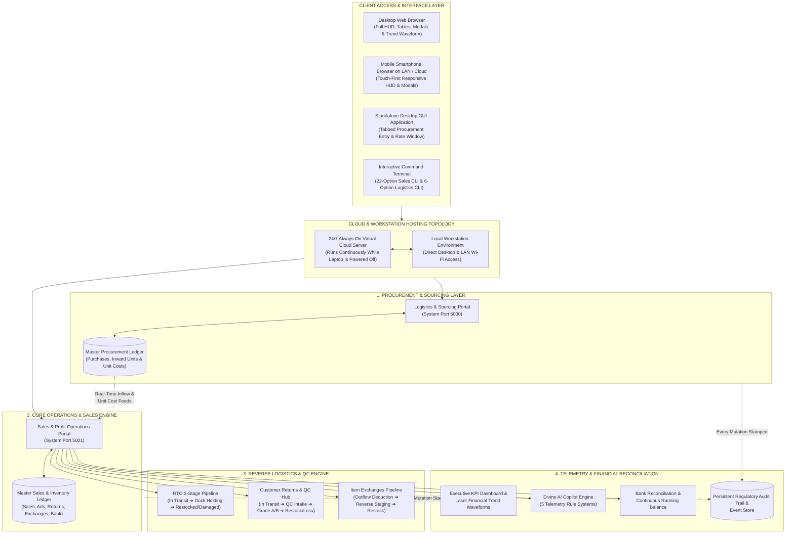
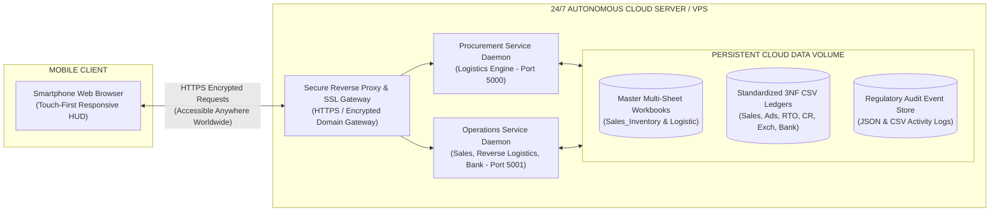
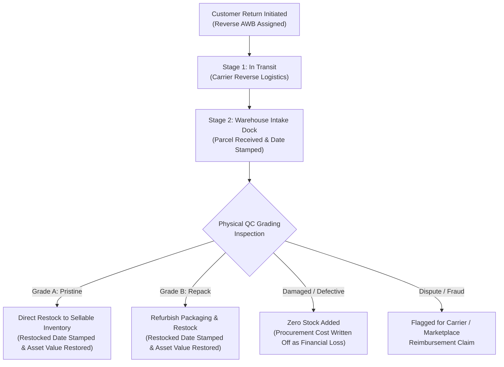
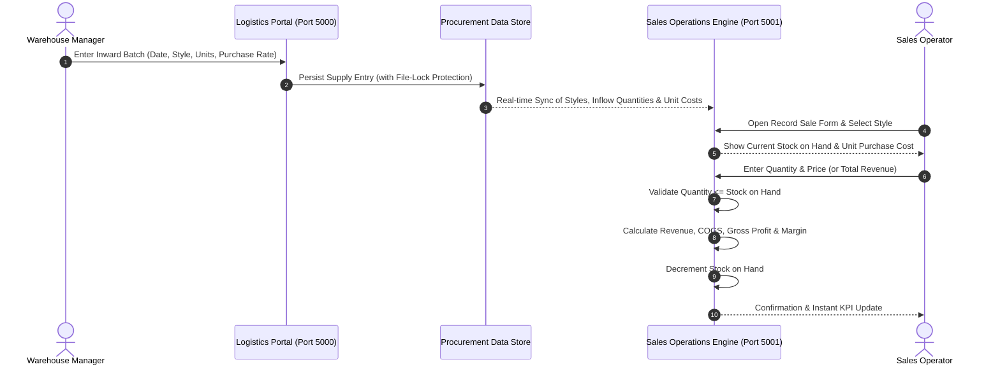
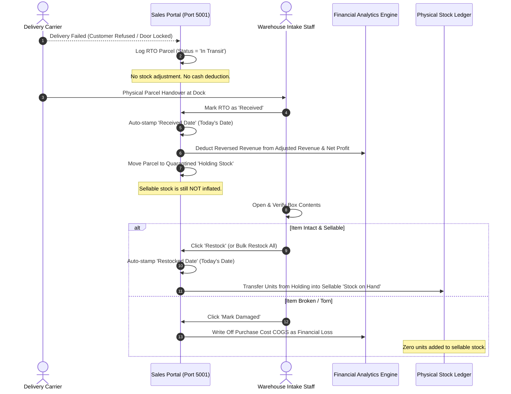
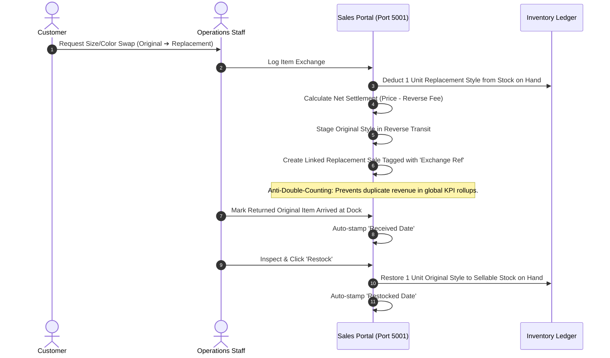

# Enterprise Sales, Inventory, Logistics & Financial Intelligence Platform

## Complete Functional Architecture, Feature Catalog, Formulas, Data Flows & Cloud Hosting Specification

---

## 1. System Architecture & High-Level Topology

The platform is designed as an integrated **dual-engine enterprise resource, logistics, and financial operations suite** that bridges procurement, sales fulfillment, reverse logistics, customer quality control, advertising attribution, and bank cash reconciliation into a real-time, synchronized environment.



---

### Architectural Principles

* **Real-Time Dual-Directional Synchronization**: Sourcing purchase rates and inward unit quantities recorded in the Procurement layer dynamically feed into the Sales and Inventory matrix to govern Cost of Goods Sold (COGS), margin calculations, and inventory ceilings.
* **Non-Volatile Dual-Tier Ledger Persistence**: Every transaction (sale, return, exchange, ad expense, banking entry, inventory adjustment) is immediately recorded across both high-level structured multi-sheet workbooks and flat 3NF standardized normalized data ledgers.
* **Quarantine-First Reverse Logistics**: Incoming parcels (courier non-deliveries, customer returns, exchanges) never falsely inflate active sellable stock. Uninspected items enter protected quarantine buffers until physically received, unboxed, inspected, or shelved.
* **Zero-Drift Financial Accounting**: The financial engine supports transaction recording by either unit price or exact total invoice amount, computing bidirectional values to eliminate penny rounding errors across high transaction volumes.
* **Multi-Interface Access & Local Network Dual-Stacking**: Supports access via modern desktop web browsers, mobile browsers across the local Wi-Fi network (with dual-stack IPv4/IPv6 address resolution), a native graphical desktop form window, and full-featured command-line terminal menus.
* **File-Lock & Cloud-Sync Resilience**: Implements non-blocking write operations with exponential backoff retries to prevent data contention when spreadsheets are simultaneously open in external spreadsheet software or syncing with cloud storage.
* **Legacy Table Ingestion & Normalization**:
  * *Forward-Fill Date Imputation*: Automatically imputes missing dates caused by merged header cells in legacy spreadsheets.
  * *Header Alias Resolution*: Normalizes varied legacy column aliases (e.g., `Stylecode`, `Inventory (units)`, `Price ($)`, `Rate`) into standard schema fields.
  * *Subtotal Artifact Rejection*: Automatically strips out rows containing summary markers (`Total Summary`, `Grand Total`, `Total`) to preserve pure transactional data.
  * *Chronological Sorting*: Any addition or mutation triggers chronological auto-sorting by Date and Style identifier.

---

### 24/7 Always-On Cloud Deployment & Mobile Hosting Topology

*(Operating on Smartphones While the Laptop is Powered Off)*

To allow business operators to access, monitor, and manage the entire operations platform directly from their mobile smartphones 24/7—even when the primary office laptop is turned off and disconnected—the system architecture supports an autonomous cloud deployment topology:



1. **Persistent Virtual Server Runtime**: The dual services (Procurement Port 5000 and Sales Operations Port 5001) run as background service daemons on an always-on virtual cloud server or persistent container instance. This host runs continuously 24 hours a day, 365 days a year, completely independent of the physical laptop's power state.
2. **Persistent Cloud Storage Volume**: The master spreadsheets, standardized normalized CSV ledgers, and audit trail event logs reside on an attached persistent cloud storage volume. Any mutation triggered from a mobile smartphone is saved immediately to disk in the cloud.
3. **Encrypted SSL Reverse Proxy Gateway**: A secure gateway terminates SSL/TLS (HTTPS) encryption and proxies inbound requests to the appropriate operational service, protecting the system behind authentication credentials and domain routing.
4. **Touch-First Mobile Web Application**: The web client interface is fully responsive, adapting automatically to smartphone screens with touch-friendly input fields, one-click pricing chips, quick-action swipe buttons, and modal dialogs.
5. **Bidirectional Workstation Synchronization**: When the office laptop is powered back on, a background synchronization client pulls the latest cloud-updated spreadsheets and normalized ledgers to the local workstation, ensuring local Excel files reflect all transactions recorded from the phone.

---

## 2. Core Functional Modules & Feature Catalog

### Module A: Procurement & Sourcing Management (Logistics Portal - Port 5000)

1. **Supply Inward Entry**: Records supplier delivery date, unique master style code, quantity received, and purchase cost per unit.
2. **Catalog Collision Prevention**: Automatically checks if a style already exists in the inventory master; if detected, displays existing unit volume and weighted rates to prevent duplicate item creation.
3. **Dynamic Inventory Unit Updates**: Enables warehouse managers to adjust procurement volumes directly with multi-tier file-lock protection. Supports scoping adjustments across all records or isolating a specific inward date.
4. **Purchase Rate Adjustments**: Allows updating unit procurement rates (globally or for a specific delivery date), which immediately ripples across the sales engine to recalculate real-time profit margins.
5. **Item Purging**: Controlled deletion of obsolete style records (globally or scoped to a specific delivery date) with cascading confirmation checks.
6. **Aggregated Daily Supply Summary**: Groups all inward purchases by calendar date, calculating daily units received, gross capital invested, and average procurement cost.
7. **One-Click Data Exports**: Instant client-side generation of comprehensive ledger snapshots in both standard spreadsheet formats and flat structured tables.
8. **Standalone Desktop GUI Application**: A dedicated, non-browser graphical desktop application featuring tabbed visual forms:
   * *Tab 1: Add Transaction Form* (Date, Style No., Units, Purchase Rate with instant Total Value preview).
   * *Tab 2: Update Inventory Units Form* (Search style, display historical inward dates, adjust quantities).
   * *Tab 3: Update Purchase Rate Form* (Search style, modify rate globally or by delivery date).
   * *Tab 4: Delete Style Form* (Purge obsolete item records with confirmation prompt).

---

### Module B: Sales, Profit & Dispatched Orders Engine (Sales Portal - Port 5001)

1. **Direct Style Autocomplete & Stock Lookup**: Integrates with the procurement catalog. Selecting a style instantly displays its purchase cost, historical sales, and current sellable stock.
2. **Over-Sell & Stockout Prevention Warning**: Real-time validation alerts operators if the quantity entered exceeds physical sellable inventory. Throws immediate visual validation warnings.
3. **Dual-Input Pricing Matrix with Default Pricing Engine**:
   * *Per-Unit Pricing*: Enter price per single unit.
   * *Automated Default Price*: If the selling price input is empty upon style selection, it automatically defaults to a **+35% profit markup** ($\text{Purchase Cost} \times 1.35$).
   * *Quick Markup Selectors*: One-click interactive markup chips allowing instant price setting at:
     * **+25%** ($\text{Cost} \times 1.25$)
     * **+35%** ($\text{Cost} \times 1.35$)
     * **+50%** ($\text{Cost} \times 1.50$)
     * **+75%** ($\text{Cost} \times 1.75$)
   * *Invoice-Total Pricing*: Enter the exact total invoice billing amount.
   * *Bidirectional Calculation*: Adjusting either field instantly recomputes the counterpart with 4-decimal precision back-calculation to eliminate penny drift.
4. **Real-Time Profitability Preview Box**: Before confirming an order, dynamically calculates and displays Gross Revenue, Purchase COGS, Gross Profit, Profit Margin percentage, and remaining post-sale stock balance.
5. **Comprehensive Sales Ledger**: Searchable, chronological log of all orders showing date, style, units, selling price, revenue, COGS, profit, margin, and order origin reference, with row-level edit and delete controls.
6. **Fast Record Sale Global Modal**: Popup form accessible from anywhere in the portal via a persistent header button, allowing rapid transaction recording without leaving the current workspace.
7. **Inline Transaction Edit Modal**: Full-featured modal to adjust previously recorded dates, quantities, style numbers, or prices, automatically restoring old stock and deducting new stock upon saving.
8. **Row-Level Order Deletion**: Deleting a sales order permanently removes the transaction, automatically restores the sold units back into sellable inventory, and updates headline KPIs.

---

### Module C: Real-Time Stock Balance & Inventory Matrix

A unified multi-dimensional table calculating true physical stock availability across the supply chain:

* **Purchased Inflow**: Lifetime units received from procurement.
* **Sold Outflow**: Units dispatched through sales orders.
* **Exchanged Outflow**: Units dispatched to replace customer size/color swaps.
* **Restocked RTO Units**: Courier non-delivery parcels returned, unboxed, and shelved.
* **Restocked Customer Returns**: Post-delivery returns inspected, approved, and shelved.
* **Restocked Exchange Units**: Old items returned by customers from exchanges and shelved.
* **Usable Stock on Hand**: True physical count ready for immediate fulfillment.
* **Inventory Valuation**: Monetary asset value of remaining stock at cost.
* **Lifetime Style Revenue & Profit**: Total financial yield generated by each style code.
* **4-Tier Visual Stock Health Badges**:
  * 🟢 **In Stock**: Healthy supply ($> 5$ units).
  * 🟡 **Low Stock**: Approaching depletion ($1 - 5$ units).
  * 🔴 **Out of Stock**: Completely depleted ($0$ units).
  * ⚠️ **Over Sold**: Negative inventory count ($< 0$ units), alerting operators that order demand has exceeded verified physical supply.

---

### Module D: Courier Return-to-Origin (RTO) 3-Stage Pipeline

Addresses doorstep delivery failures where parcels return unopened with the shipping carrier.

```mermaid
stateDiagram-v2
    [*] --> InTransit: Customer Rejects / Courier Non-Delivery
    InTransit --> InHoldingPile: Parcel Arrives at Warehouse Dock
    note right of InHoldingPile
        Trigger 1: Automatic 'Received Date' timestamped.
        Trigger 2: Adjusted Revenue & Net Profit immediately reduced.
        Inventory: Kept in quarantine; sellable stock NOT inflated.
    end note
    InHoldingPile --> RestockedActive: Unboxed & Shelved (Single or Bulk)
    note right of RestockedActive
        Trigger: Automatic 'Restocked Date' timestamped.
        Inventory: Transferred from quarantine to usable stock.
    end note
    InHoldingPile --> DamagedWriteOff: Damaged in Transit (Write-Off)
    RestockedActive --> [*]
    DamagedWriteOff --> [*]
```



1. **Stage 1 (In Transit)**: Courier initiates return. The system tracks the tracking code and reason without altering sellable inventory or realized cash.
2. **Stage 2 (In Holding Pile / Dock Arrival)**: Parcel arrives at the warehouse door:
   * **Automated Date Stamping**: Automatically stamps today's date as the `Received Date`.
   * **Financial Adjustment**: Immediately deducts the reversed order value from *Adjusted Sales Revenue* and *Adjusted Net Profit*.
   * **Inventory Protection**: Units are placed in a quarantined **RTO Holding Stock** pool; they do *not* enter sellable inventory until unboxed.
3. **Stage 3 (Restocked / Shelved)**: Verified parcels are shelved back into active usable stock. Automatically stamps the `Restocked Date`. Available as:
   * *Single-item restocking*: Restock parcels individually upon inspection.
   * *Bulk Restock Engine*: 1-click button to restock the entire dock holding pile at once.
4. **Branch: Damage Write-Off**: Returns damaged in transit are flagged as write-offs. Zero stock is added, and the procurement COGS is absorbed as an operational financial loss.
5. **RTO Record Edit Modal**: Complete modal overlay to retroactively correct quantities, dates, style numbers, courier fees, tracking numbers, or carrier notes.
6. **1-Click Table Actions**: Inline table buttons to Mark Received, Restock, Mark Damaged, Edit, or Delete individual RTO records.

---

### Module E: Customer Returns & Physical QC Grading Hub

Handles opened, delivered orders returned by customers after delivery (fit issues, remorse, defects).



1. **Fast Auto-Fill from Customer Order**: Selecting a previous order automatically populates style number, quantity, and eligible customer refund amount.
2. **Automated Milestone Date Stamping**: Marking arrival stamps `Received Date`; completing inspection and restocking stamps `Restocked Date`.
3. **Reverse Courier Shipping Deduction**: Tracks the carrier reverse pickup cost (standard default $175.00) separate from customer refund value.
4. **Structured Reason Taxonomy**: Captures both Primary Reasons (e.g., Size Too Small / Fit Issue, Fabric Quality, Wrong Color, Defective) and Secondary Remarks.
5. **Physical Quality Control (QC) Grading Matrix**:
   * **Grade A (Pristine)**: Unworn with original tags intact ➔ directly restored into sellable inventory.
   * **Grade B (Repack / Minor Wear)**: Minor box fold or repackaging needed ➔ refurbished and restored into sellable inventory.
   * **Damaged / Defective**: Torn, stained, or washed ➔ zero stock added; procurement cost recorded as an operational write-off.
   * **Dispute / Fraud**: Empty box, stone/paper swap, or wrong item returned ➔ placed on hold for carrier or marketplace compensation claims.
6. **1-Click Table QC Action Shortcuts**:
   * *Quick Restock*: Single-click inline button to instantly grade as Grade A and restore to active stock.
   * *Quick Damage Write-Off*: Single-click inline button to flag as damaged with confirmation verification.
7. **Bulk Intake Restock**: Fast-track intake capability to approve and restock all dock-intake returns into Grade A inventory with a single command.
8. **Customer Return Edit Modal**: Complete modal overlay to amend refund sums, reverse courier fees, return reasons, and tracking numbers.

---

### Module F: Item Exchanges Management

Designed specifically for e-commerce apparel exchanges (customer swaps for a different size or color of the same product line):

1. **Replacement Dispatched Outflow**: Recording an exchange immediately subtracts 1 unit of the *Exchanged Style* from sellable inventory.
2. **Returned Item Reverse Staging**: The *Original Style* is logged in reverse transit and does *not* enter active inventory until physically received and restocked.
3. **Net Cash Inflow Formula**: Automatically calculates customer settlement by deducting the reverse courier shipping fee from the standard order price.
4. **Exchange Sales Ledger Synchronization & Anti-Double-Counting**:
   * Exchanges can be synchronized with the master Sales Ledger, marked with an `Exchange Reference` tag.
   * The financial engine automatically checks for existing exchange references to prevent double-counting of revenue, COGS, and profit in global KPI summaries.
5. **Dedicated Pipeline Hub**: Tracks exchange items through Transit, Intake Dock, Restocked, and Damaged states.
6. **1-Click Table Actions**: Receive at dock, Restock original style into stock, Mark damaged write-off, and 1-Click Bulk Restock for all intake exchanges.
7. **Exchange Edit Modal**: Full-featured modal to adjust styles, replacement prices, reverse courier fees, and reasons.

---

### Module G: Marketing & Ad Spend Tracker

1. **Multi-Channel Platform Attribution**: Logs daily advertising outlays across Meta (Instagram/Facebook), Google Ads, Meesho Ads, Influencer Campaigns, YouTube, TikTok/Pinterest, and Offline media.
2. **Profit Deductions**: Automatically subtracts marketing spend from Gross Profit to establish true Net Realized Profit.
3. **Real-Time Return on Ad Spend (ROAS)**: Computes continuous efficiency multipliers comparing gross revenue against ad spend.
4. **Editable Campaign Ledger & Modal**: Full historical table allowing retroactive adjustments of spend numbers, platform tags, and campaign notes via an inline edit modal.
5. **Row Deletion**: Permanently remove erroneous spend records with instant recalculation of Net Profit and ROAS.

---

### Module H: Daily Performance & Analytics Hub

Dedicated analytical reporting tables breaking down operations by calendar date:

1. **Table 1 (Daily Sales & Gross Profit)**: Date, Dispatched Order Count, Units Sold, Gross Dispatched Revenue, Dispatched COGS, Daily Gross Profit, and Gross Profit Margin percentage.
2. **Table 2 (Daily Advertising Spend)**: Date, Active Campaign Count, Channels/Platforms Utilized, Total Daily Marketing Outlay, and Campaign Notes.
3. **Sub-View Filter**: One-click toggles to inspect both tables side-by-side, sales only, or advertising only.

---

### Module I: Bank Account Transactions & Continuous Reconciliation

1. **Dual Entry Types**: Tracks **Credited (+ Inflow / Customer Remittance / Capital Deposits)** and **Debited (- Outflow / Vendor Payments / Operational Expenses)**.
2. **Continuous Running Balance**: Recalculates the exact bank balance after every ledger entry chronologically.
3. **Executive Bank Telemetry**: Summary cards displaying Current Bank Balance, Total Historical Credits, Total Historical Debits, and Total Transaction Ledger Count.
4. **Bank Transaction Edit Modal**: Dedicated popup modal to modify transaction dates, types, or amounts with automatic ledger rebalancing.
5. **Bank Transaction Deletion**: Deletes transaction rows and recalculates the continuous running balance chain.

---

### Module J: Executive AI Copilot & Visual Telemetry HUD

1. **Divine AI Copilot Engine (5 Distinct Intelligence Rule Systems)**:
   * **Rule 1 (Star Performer Insight)**: Evaluates all sales transactions, identifies the single highest profit-generating style, and displays realized profit, margin %, units sold, and an *Inspect Ledger* shortcut.
   * **Rule 2 (Inventory Radar / Reorder Alert)**: Scans all styles with $\le 5$ units remaining, identifies critical SKUs, and issues proactive restock recommendations to prevent stockouts (or confirms healthy portfolio valuation).
   * **Rule 3 (Marketing Telemetry & Acquisition Efficiency)**: Computes real-time ROAS and categorizes efficiency into visual tiers (Tier 1: $\ge 4.0\text{x}$ elite purple, Tier 2: $\ge 2.0\text{x}$ healthy cyan, Tier 3: $< 2.0\text{x}$ alert amber; or announces pure organic growth mode when spend is $0).
   * **Rule 4 (Warehouse Staging Opportunity)**: Detects quarantined RTO units in holding stock and generates an interactive **"Restock All Now"** action button inside the banner that triggers bulk restocking directly.
   * **Rule 5 (Margin Velocity & Bottom-Line Integrity)**: Synthesizes final realized net cash, net margin %, and sync status with direct navigation to daily analytical tables.
2. **AI Copilot Interactive Navigation**:
   * Auto-rotates through insights every 8 seconds.
   * Pause-on-hover capability.
   * Interactive pagination pill indicators with manual next, previous, and direct jump controls.
   * Interactive Action Buttons that switch tabs and focus on relevant datasets or trigger bulk execution.
3. **Laser Waveform Financial Trend Chart**: Visual multi-line area chart rendering daily Gross Revenue, Net Realized Profit, and Procurement COGS over 7-Day, 30-Day, and All-Time horizons.
4. **Operational Telemetry Strips**: Three color-coded metric strips on the main dashboard providing instant unit counts and restock triggers for RTO, Customer Returns, and Exchanges.

---

### Module K: System Audit Trail & Regulatory History

* **Chronological Event Logging**: Automatically records every system event across Sales, Procurement, Marketing, RTO, Customer Returns, Exchanges, Banking, and Manual Syncs.
* **Data Logged**: Unique Sequence ID, Precise Timestamp, Event Category, Action Type, Human-Readable Summary, Severity Status (Success, Warning, Danger, Info), Initiating Source, and Snapshot Payload.
* **Audit Hub UI (`/history`)**: Live auto-refreshing interface (every 5 seconds) with keyword search, category filter pills, CSV audit report download, and secure log archiving.
* **Automated Archiving Engine**: When logs are cleared, the system automatically creates a timestamped archive snapshot file on disk before initializing a fresh audit trail.

---

### Module L: Native Spreadsheet Formula & Styling Engine

When generating and saving master workbooks, the platform writes native spreadsheet formulas, professional typography, and accounting formatting across both primary workbooks:

#### Master Sales & Inventory Workbook (9 Dedicated Sheets)

1. **Sales Sheet** (Navy Header `#1E3A8A`): Sl No., Date, Style No., Quantity Sold, Selling Price, Total Revenue, COGS, Profit, Profit Margin %, Reference Link. Injects row-level formulas and `=SUM(D2:D{last})`, `=SUM(F2:F{last})`, `=SUM(G2:G{last})`, `=SUM(H2:H{last})`, `=IF(F{row}>0, H{row}/F{row}, 0)`.
2. **Stock Inventory Sheet** (Forest Emerald Header `#065F46`): Style No., Total Purchased, Total Sold, In-Transit RTO, RTO Holding, Restocked RTO, Stock on Hand, Unit Cost, Stock Valuation, Total Profit, Status. Injects `=SUM(...)` across all unit counts and valuations.
3. **RTO Tracker Sheet** (Amber Header `#B45309`): RTO ID, Date, Style No., Quantity, Sale Price, Reversed Revenue, Courier Fee, Status, Received Date, Restocked Date, Tracking No., Notes.
4. **Customer Returns Sheet** (Indigo Header `#4338CA`): Return ID, Date, Style No., Quantity, Refund Amount, Reverse Fee, Primary Reason, Secondary Reason, Status, Received Date, Restocked Date, Reverse AWB. Injects `=SUM(...)` for refunds and fees.
5. **Exchanges Sheet** (Vibrant Emerald Header `#047857`): Exchange ID, Date, Original Style, Exchanged Style, Quantity, Standard Price, Reverse Fee, Amount Received, COGS, Profit, Return Status, Exchange Status, Reverse AWB, Received Date, Restocked Date. Injects `=SUM(...)` and `=AVERAGE(...)` summaries.
6. **Ad Spend Sheet** (Purple Header `#6B21A8`): Date, Platform, Amount, Notes. Injects `=SUM(C2:C{last})`.
7. **Bank Transactions Sheet** (Deep Teal Header `#0F766E`): Sl No., Date, Type, Amount, Running Balance.
8. **Daily Sales Summary Sheet** (Slate Header `#334155`): Date, Orders Count, Units Sold, Gross Revenue, COGS, Gross Profit, Gross Margin %. Injects `=SUMIF(Sales!$A:$A, A{row}, Sales!$C:$C)`, `=SUMIF(Sales!$A:$A, A{row}, Sales!$E:$E)`, `=SUMIF(Sales!$A:$A, A{row}, Sales!$G:$G)`, `=D{row}-E{row}`, `=IF(D{row}>0, (F{row}/D{row})*100, 0)`.
9. **Daily Ad Spend Summary Sheet** (Purple Header `#6B21A8`): Date, Campaign Count, Platforms Used, Total Ad Spend. Injects `=SUMIF('Ad Spend'!$A:$A, A{row}, 'Ad Spend'!$C:$C)`.

#### Master Logistics Workbook (2 Dedicated Sheets)

1. **Transactions Sheet** (Navy Header `#1E3A8A`): Date, Style No., Inventory, Purchase Rate, Total Value. Formatted as an official Excel Table with zebra striping and double-underline summary row (`=SUM(...)`, `=AVERAGE(...)`).
2. **Daily Summary Sheet** (Navy Header `#1E3A8A`): Date, Style Count, Total Units, Daily Gross Total, Avg Purchase Rate. Injects `=SUM(...)` and `=AVERAGE(...)`.

---

### Module M: Dual-Mode Data Export Engine

1. **Client-Side Browser Export (Instant Generation)**:
   * *SheetJS Multi-Sheet Excel*: Bundles both Sales and Stock into an `.xlsx` file generated directly in browser memory without server latency.
   * *Client-Side CSV Download*: Generates and downloads `Sales_Normalized.csv` directly to the user's downloads folder.
2. **Server-Side File Persistence**:
   * Synchronously writes 9-sheet `Sales_Inventory.xlsx` and 2-sheet `Logistic.xlsx` to disk.
   * Synchronously writes 7 standardized CSV ledgers on disk.
   * Includes file-lock detection with exponential retry to prevent data loss when files are open in Microsoft Excel.

---

## 3. Mathematical & Financial Formulas Reference

### A. Inventory Availability & Valuation Formulas

#### 1. Usable Stock on Hand

$$
\text{Stock on Hand} = \text{Units Purchased} - \text{Units Sold} - \text{Exchanged Outflow} + \text{Restocked RTO} + \text{Restocked CR} + \text{Restocked Exch}
$$

#### 2. Warehouse Stock Valuation (Asset Value at Cost)

$$
\text{Stock Valuation} = \text{Stock on Hand} \times \text{Unit Purchase Cost}
$$

#### 3. Total Procurement Portfolio Value

$$
\text{Total Portfolio Value} = \sum_{i=1}^{N} \left( \text{Units Received}_i \times \text{Purchase Rate}_i \right)
$$

#### 4. Weighted Average Procurement Cost

$$
\text{Weighted Average Cost} = \frac{\sum_{i=1}^{N} \left( \text{Units Received}_i \times \text{Purchase Rate}_i \right)}{\sum_{i=1}^{N} \text{Units Received}_i}
$$

---

### B. Sales, Revenue & Cost of Goods Sold (COGS) Formulas

#### 5. Gross Sales Revenue

$$
\text{Gross Revenue} = \text{Quantity Sold} \times \text{Unit Selling Price}
$$

*Or, if entered via Total Invoice:*

$$
\text{Unit Selling Price} = \frac{\text{Total Invoice Revenue}}{\text{Quantity Sold}}
$$

#### 6. Global Combined Sales & Exchange Revenue (Anti-Double-Counting)

$$
\text{Total System Revenue} = \text{Sales Dispatched Revenue} + \max(0, \text{Exchange Gross Revenue} - \text{Synchronized Exchange Revenue in Sales})
$$

#### 7. Cost of Goods Sold (COGS)

$$
\text{COGS} = \text{Quantity Sold} \times \text{Unit Purchase Cost}
$$

#### 8. Gross Profit

$$
\text{Gross Profit} = \text{Total System Revenue} - \text{Total System COGS}
$$

#### 9. Gross Profit Margin Percentage

$$
\text{Gross Margin (\%)} = \left( \frac{\text{Gross Profit}}{\text{Total System Revenue}} \right) \times 100
$$

#### 10. Average Order Value (AOV)

$$
\text{AOV} = \frac{\text{Gross Sales Revenue}}{\text{Total Number of Orders Dispatched}}
$$

---

### C. Reverse Logistics & Cash Adjustment Formulas

#### 11. Adjusted Sales Revenue (Realized Post-Return Cash)

$$
\text{Adjusted Revenue} = \max(0, \text{Total System Revenue} - \text{Reversed Revenue of Received RTOs} - \text{Customer Refunds Issued on Arrived Returns})
$$

*(Note: Orders merely in-transit do NOT deduct revenue until parcels arrive at the dock).*

#### 12. Adjusted Units Sold

$$
\text{Adjusted Units Sold} = \max(0, \text{Total Units Sold} + \text{Unsynchronized Exchange Units} - \text{Received RTO Units} - \text{Arrived Customer Return Units})
$$

#### 13. Recovered Inventory COGS (Restocked Inflow)

$$
\text{Recovered COGS} = \sum_{j \in \text{Restocked}} \left( \text{Restocked Units}_j \times \text{Unit Purchase Cost}_j \right)
$$

#### 14. Damaged Inventory COGS Loss (Write-Offs)

$$
\text{Damaged COGS Loss} = \sum_{k \in \text{Damaged}} \left( \text{Damaged Units}_k \times \text{Unit Purchase Cost}_k \right)
$$

#### 15. Reversed Profit Deductions

$$
\text{Reversed Profit (RTO)} = \text{Reversed Revenue Received} - \text{Recovered COGS (RTO)}
$$

$$
\text{Reversed Profit (CR)} = \text{Realized Customer Refunds} - \text{Recovered COGS (CR)}
$$

#### 16. Dispatched Net Profit (Pre-Returns Adjustment)

$$
\text{Net Profit} = \text{Gross Profit} - \text{Total Ad Spend} - \text{Total RTO Courier Fees} - \text{Customer Return Received Fees}
$$

#### 17. Net Realized Profit (Final True Bottom Line)

$$
\text{Adjusted Net Profit} = \text{Net Profit} - \text{Reversed Profit (RTO)} - \text{Damaged COGS Loss (RTO)} - \text{Reversed Profit (CR)} - \text{Damaged COGS Loss (CR)}
$$

#### 18. Net Realized Margin Percentage

$$
\text{Adjusted Net Margin (\%)} = \left( \frac{\text{Adjusted Net Profit}}{\text{Adjusted Revenue}} \right) \times 100
$$

#### 19. Reverse Logistics Rates

$$
\text{RTO Rate (\%)} = \left( \frac{\text{Total RTO Units}}{\text{Total Units Sold}} \right) \times 100
$$

$$
\text{Customer Return Rate (\%)} = \left( \frac{\text{Total Customer Return Units}}{\text{Total Units Sold}} \right) \times 100
$$

$$
\text{Exchange Rate (\%)} = \left( \frac{\text{Total Exchange Units}}{\text{Total Units Sold}} \right) \times 100
$$

#### 20. Item Exchange Net Cash Settlement

$$
\text{Exchange Amount Received} = (\text{Standard Replacement Price} \times \text{Quantity}) - \text{Reverse Courier Shipping Fee}
$$

---

### D. Marketing & Banking Formulas

#### 21. Return on Advertising Spend (ROAS)

$$
\text{Dispatched ROAS} = \frac{\text{Total System Revenue}}{\text{Total Advertising Spend}}
$$

$$
\text{Adjusted Realized ROAS} = \frac{\text{Adjusted Revenue}}{\text{Total Advertising Spend}}
$$

#### 22. Continuous Bank Running Balance

$$
\text{Running Balance}_t = \text{Running Balance}_{t-1} + \text{Credit Amount}_t - \text{Debit Amount}_t
$$

#### 23. Dynamic Price Markup Formula

$$
\text{Recommended Selling Price} = \text{Unit Purchase Cost} \times (1 + M)
$$

*Where $M \in \{0.25, 0.35, 0.50, 0.75\}$ for one-click quick markup selectors.*

---

## 4. End-to-End Data Flows

### Flow 1: Procurement to Fulfillment Lifecycle



---

### Flow 2: Courier Return-to-Origin (RTO) Reconciliation Flow



---

### Flow 3: Customer Return & Physical QC Flow

```mermaid
sequenceDiagram
    autonumber
    actor Customer as Customer
    actor Agent as Support Agent
    actor QCOfficer as Quality Control Officer
    participant System as Operations Hub (Port 5001)
    participant Inventory as Usable Inventory

    Customer->>Agent: Requests Return (Size / Defect / Remorse)
    Agent->>System: Record Customer Return (Select Past Order, Refund Amt, Reverse Fee)
    System->>System: Mark 'In Transit' (AWB Tracked)
  
    Customer-->>QCOfficer: Parcel Arrives at Warehouse Intake Dock
    QCOfficer->>System: Mark 'Received in QC Intake'
    System->>System: Auto-stamp 'Received Date' (Today's Date)
    QCOfficer->>QCOfficer: Physical Inspection & Grading
  
    alt Grade A (Pristine) or Grade B (Repack)
        QCOfficer->>System: Assign 'Grade A' / 'Grade B'
        System->>System: Auto-stamp 'Restocked Date' (Today's Date)
        System->>Inventory: Add Units Directly to Sellable Stock on Hand
        System->>System: Recover Inventory Asset Valuation
    else Damaged / Defective
        QCOfficer->>System: Assign 'Damaged'
        System->>System: Zero Stock Added; Write Off Procurement Cost as Loss
    else Dispute / Fraud (Empty Box / Swap)
        QCOfficer->>System: Assign 'Dispute'
        System->>System: Freeze Record & Open Marketplace Claim Ticket
    end
```

---

### Flow 4: Item Exchange Flow & Anti-Double-Counting



---

## 5. Event Triggers & Automated Side-Effects Matrix

| Trigger Event                                | Source                                      | Primary System Action                           | Automated Financial & Inventory Side-Effects                                                                                                                                                                                                                                    | Audit Log Action              |
| :------------------------------------------- | :------------------------------------------ | :---------------------------------------------- | :------------------------------------------------------------------------------------------------------------------------------------------------------------------------------------------------------------------------------------------------------------------------------ | :---------------------------- |
| **New Inward Batch Logged**            | Logistics Portal (Port 5000) or Desktop GUI | Stores batch in Procurement Ledger              | • Total inventory units purchased increases.• Procurement portfolio value increases.• Style becomes selectable in Sales Portal.• Unit purchase cost established for COGS.                                                                                                   | `STOCK / CREATE`            |
| **Procurement Rate Updated**           | Logistics Portal (Port 5000) or Desktop GUI | Overwrites unit purchase rate                   | • Updates portfolio valuation.• Recalculates unit cost and Gross Profit margins across unsold inventory in real time.                                                                                                                                                         | `STOCK / UPDATE`            |
| **Sale Order Recorded**                | Sales Portal (Port 5001)                    | Commits order to Sales Ledger                   | • Immediate validation: throws error if Qty > Stock on Hand.• Deducts Qty from `Stock on Hand`.• Computes COGS, Gross Profit, and Gross Margin.• Increments Gross Sales Revenue and Units Sold.• Recalculates AOV and ROAS.• Updates Daily Sales Summary.               | `SALE / CREATE`             |
| **Sale Order Edited**                  | Sales Portal (Port 5001)                    | Updates transaction row                         | • Restores previous quantity to stock, then applies new quantity.• Re-evaluates COGS and profit based on current unit cost.• Recalculates all executive KPI cards.                                                                                                           | `SALE / UPDATE`             |
| **Sale Order Deleted**                 | Sales Portal (Port 5001)                    | Purges transaction row                          | • Restores sold quantity back into sellable`Stock on Hand`.• Deducts revenue and profit from headline KPIs.                                                                                                                                                                 | `SALE / DELETE`             |
| **RTO Logged (In Transit)**            | Sales Portal (Port 5001)                    | Creates RTO entry with status`In Transit`     | • Increments In-Transit RTO unit counter.• No adjustments made to cash or sellable stock.                                                                                                                                                                                     | `RTO / CREATE`              |
| **RTO Marked 'Received'**              | Sales Portal (Port 5001)                    | Updates status to`Received`                   | • Automatically sets`Received Date` to today's date.• Decrements In-Transit counter, increments Holding Pile counter.• Immediately deducts order value from **Adjusted Revenue** and **Adjusted Net Profit**.• Leaves sellable stock untouched in quarantine. | `RTO / RECEIVE`             |
| **RTO Restocked (Single or Bulk)**     | Sales Portal (Port 5001)                    | Updates status to`Restocked`                  | • Automatically sets`Restocked Date` to today's date.• Deducts units from Holding Pile.• Adds units into active usable **Stock on Hand**.• Increases Stock Valuation at cost.                                                                                       | `RTO / RESTOCK`             |
| **RTO Marked 'Damaged'**               | Sales Portal (Port 5001)                    | Updates status to`Damaged`                    | • Removes parcel from Holding Pile.• Zero units added to sellable stock.• Absorbs procurement COGS as permanent financial loss.                                                                                                                                              | `RTO / DAMAGE`              |
| **Customer Return Logged**             | Sales Portal (Port 5001)                    | Creates return record with status`In Transit` | • Increments Reverse In-Transit telemetry pill.• Sets expected refund and reverse courier fee.                                                                                                                                                                                | `CUSTOMER_RETURN / CREATE`  |
| **Customer Return Marked 'Received'**  | Sales Portal (Port 5001)                    | Updates status to`Intake`                     | • Automatically sets`Received Date` to today's date.• Moves parcel to QC Intake queue awaiting inspection.                                                                                                                                                                  | `CUSTOMER_RETURN / RECEIVE` |
| **Customer Return Graded (Grade A/B)** | Sales Portal (Port 5001)                    | Assigns Grade and status`Restocked`           | • Automatically sets`Restocked Date` to today's date.• Adds return quantity directly to usable **Stock on Hand**.• Recovers asset valuation in warehouse inventory.• Deducts refund and shipping fees from Net Realized Profit.                                     | `CUSTOMER_RETURN / GRADE`   |
| **Customer Return Graded (Damaged)**   | Sales Portal (Port 5001)                    | Assigns status`Damaged`                       | • Zero stock added.• Deducts refund, shipping fees, and full purchase COGS as write-off.                                                                                                                                                                                      | `CUSTOMER_RETURN / GRADE`   |
| **Bulk Restock Intake Returns**        | Sales Portal (Port 5001)                    | Transitions all Intake items to`Restocked`    | • Shelves all received return units as Grade A in sellable inventory in 1 click.• Automatically stamps `Restocked Date`.                                                                                                                                                    | `CUSTOMER_RETURN / RESTOCK` |
| **Item Exchange Recorded**             | Sales Portal (Port 5001)                    | Commits exchange transaction                    | • Instantly subtracts 1 unit of Exchanged Style from sellable stock.• Adds Original Style to reverse in-transit pipeline.• Calculates Net Inflow: $\text{Price} - \text{Reverse Shipping Fee}$.                                                                            | `EXCHANGE / CREATE`         |
| **Exchange Returned Item Restocked**   | Sales Portal (Port 5001)                    | Updates status to`Restocked`                  | • Restores 1 unit of Original Style back to active sellable stock.                                                                                                                                                                                                             | `EXCHANGE / RESTOCK`        |
| **Exchange Synchronized to Sales**     | Sales Portal (Port 5001)                    | Injects replacement order into sales ledger     | • Tags entry with`Exchange Ref` to prevent double-counting in global KPI rollups.                                                                                                                                                                                            | `EXCHANGE / SYNC`           |
| **Ad Spend Recorded**                  | Sales Portal (Port 5001)                    | Appends entry to Marketing Ledger               | • Increments Total Marketing Spend.• Deducts spend from Lifetime and Daily Net Realized Profit.• Recalculates ROAS and Adjusted ROAS.                                                                                                                                        | `AD_SPEND / CREATE`         |
| **Bank Credit / Debit Logged**         | Sales Portal (Port 5001)                    | Appends entry to Bank Ledger                    | • Recalculates continuous running balance.• Increments total credited or debited summaries.                                                                                                                                                                                   | `BANK / CREATE`             |
| **Logistics Resync Triggered**         | Sales Portal (Port 5001)                    | Re-reads Procurement Ledger                     | • Updates style catalog, procurement costs, and stock inflow totals.• Recalculates stock balances and valuations across all styles.                                                                                                                                           | `SYNC / SYNC`               |
| **Audit Logs Archived & Cleared**      | Audit Hub (`/history`)                    | Creates backup archive on disk                  | • Saves timestamped archive snapshot before initializing fresh audit log.                                                                                                                                                                                                      | `SYSTEM / CLEAR`            |

---

## 6. Comprehensive Search & Filter Matrix

| Interface Section               | Keyword Search Target Fields                                                                                        | Status / Scope Filter Chips                                                                       | Sorting Options                        |
| :------------------------------ | :------------------------------------------------------------------------------------------------------------------ | :------------------------------------------------------------------------------------------------ | :------------------------------------- |
| **Sales Ledger**          | `Style No.`, `Date`                                                                                             | Date Sorting                                                                                      | Chronological (Ascending / Descending) |
| **Ad Spend Tracker**      | `Platform / Channel`, `Date`, `Campaign Notes`                                                                | Chronological                                                                                     | Chronological                          |
| **RTO Pipeline**          | `Style No.`, `RTO ID`, `Tracking AWB`, `Notes`                                                              | `All`, `In Transit`, `In Holding`, `Restocked`, `Damaged`                               | Chronological                          |
| **Customer Returns Hub**  | `Return ID`, `Style No.`, `Primary Reason`, `Secondary Reason`, `Reverse AWB`                             | `All`, `In Transit`, `In Intake`, `Restocked`, `Damaged`                                | Chronological                          |
| **Item Exchanges Hub**    | `Exchange ID`, `Original Style`, `Exchanged Style`, `Primary Reason`, `Secondary Reason`, `Reverse AWB` | `All`, `In Transit`, `In Intake`, `Restocked`, `Damaged`                                | Chronological                          |
| **Stock Balance Matrix**  | `Style No.`                                                                                                       | Color-coded health badges (In Stock, Low Stock, Out of Stock, Over Sold)                          | Alphanumeric by Style No.              |
| **Bank Ledger**           | `Date`, `Amount`                                                                                                | `All`, `Credited (+)`, `Debited (-)`                                                        | Chronological                          |
| **Daily Analytics**       | Calendar Date                                                                                                       | `View Both Tables`, `Daily Sales Only`, `Daily Ad Spend Only`                               | Chronological                          |
| **Financial Trend Chart** | Calendar Date Range                                                                                                 | `7D` (Last 7 Days), `30D` (Last 30 Days), `ALL TIME`                                        | Chronological Waveform                 |
| **Audit History Hub**     | Keyword search across all summary, details & IDs                                                                    | `All`, `Sales`, `Ads`, `RTO`, `Returns`, `Exchanges`, `Stock`, `Sync`, `System` | Reverse Chronological (Latest First)   |

---

## 7. Multi-Sheet Master Spreadsheets & Persistence Matrix

### Master Sales & Inventory Workbook Structure

*Target File: `Sales_Inventory.xlsx` (9 Dedicated Worksheets)*

| Sheet #     | Sheet Title                | Theme Color Palette           | Key Schema Columns                                                                                                                                                                                                                                                                                                              | Embedded Formula Types                                                                                           |
| :---------- | :------------------------- | :---------------------------- | :------------------------------------------------------------------------------------------------------------------------------------------------------------------------------------------------------------------------------------------------------------------------------------------------------------------------------ | :--------------------------------------------------------------------------------------------------------------- |
| **1** | `Sales`                  | Classic Navy (`#1E3A8A`)    | Sl No., Date, Style No., Quantity Sold, Selling Price ($), Total Revenue ($), Cost of Goods Sold ($), Profit ($), Profit Margin (%), Reference                                                                                                                                                                              | `=SUM(D2:D{last})=SUM(F2:F{last})``=SUM(G2:G{last})=SUM(H2:H{last})``=IF(F{row}>0, H{row}/F{row}, 0)`      |
| **2** | `Stock Inventory`        | Forest Emerald (`#065F46`)  | Style No., Total Purchased, Total Sold, In-Transit RTO, RTO Holding, Restocked RTO, Stock on Hand, Unit Cost ($), Stock Valuation ($), Total Profit ($), Status                                                                                                                                                               | `=SUM(B2:B{last})` through `=SUM(G2:G{last})=SUM(I2:I{last})``=SUM(J2:J{last})`                            |
| **3** | `RTO Tracker`            | Amber (`#B45309`)           | RTO ID, Date, Style No., Quantity, Sale Price ($), Reversed Revenue ($), Courier Fee ($), Status, Received Date, Restocked Date, Tracking No., Notes                                                                                                                                                                          | Lifecycle status formatting                                                                                      |
| **4** | `Customer Returns`       | Indigo (`#4338CA`)          | Return ID, Date, Style No., Quantity, Refund Amount ($), Reverse Fee ($), Primary Reason, Secondary Reason, Status, Received Date, Restocked Date, Reverse AWB                                                                                                                                                                | `=SUM(D2:D{last})=SUM(E2:E{last})``=SUM(F2:F{last})`                                                         |
| **5** | `Exchanges`              | Vibrant Emerald (`#047857`) | Exchange ID, Date, Original Style (Returned), Exchanged Style (New), Quantity, Standard Price ($), Reverse Fee ($), Amount Received ($), COGS ($), Profit ($), Primary Reason, Secondary Reason, Return Status, Exchange Status, Reverse AWB, Received Date, Restocked Date                                                 | `=SUM(E2:E{last})=AVERAGE(F2:F{last})``=SUM(G2:G{last})=SUM(H2:H{last})``=SUM(I2:I{last})=SUM(J2:J{last})` |
| **6** | `Ad Spend`               | Purple (`#6B21A8`)          | Date, Platform, Amount ($), Notes                                                                                                                                                                                                                                                                                               | `=SUM(C2:C{last})`                                                                                             |
| **7** | `Bank Transactions`      | Deep Teal (`#0F766E`)       | Sl No., Date, Type, Amount ($), Running Balance ($)                                                                                                                                                                                                                                                                           | Running balance tracking, summary balance border                                                                 |
| **8** | `Daily Sales Summary`    | Slate (`#334155`)           | Date, Orders Count, Units Sold, Gross Revenue ($), Total COGS ($), Gross Profit ($), Gross Margin (%) | `=SUMIF(Sales!$A:$A, A{row}, Sales!$C:$C)`<br>`=SUMIF(Sales!$A:$A, A{row}, Sales!$E:$E)`<br>`=SUMIF(Sales!$A:$A, A{row}, Sales!$G:$G)`<br>`=D{row}-E{row}`<br>`=IF(D{row}>0, (F{row}/D{row})*100, 0)` |                                                                                                                  |
| **9** | `Daily Ad Spend Summary` | Purple (`#6B21A8`)          | Date, Campaign Count, Platforms Used, Total Ad Spend ($) | `=SUMIF('Ad Spend'!$A:$A, A{row}, 'Ad Spend'!$C:$C)`<br>`=SUM(B2:B{last})`<br>`=SUM(D2:D{last})`                                                                                                                                                             |                                                                                                                  |

---

### Master Logistics Workbook Structure

*Target File: `Logistic.xlsx` (2 Dedicated Worksheets)*

| Sheet #     | Sheet Title       | Theme Color Palette        | Key Schema Columns                                                   | Embedded Formula Types                                                                         |
| :---------- | :---------------- | :------------------------- | :------------------------------------------------------------------- | :--------------------------------------------------------------------------------------------- |
| **1** | `Transactions`  | Classic Navy (`#1E3A8A`) | Date, Style No., Inventory, Purchase Rate, Total Value               | Official Excel Table (`LogisticsData`), `=C{row}*D{row}`, `=SUM(...)`, `=AVERAGE(...)` |
| **2** | `Daily Summary` | Classic Navy (`#1E3A8A`) | Date, Style Count, Total Units, Daily Gross Total, Avg Purchase Rate | `=SUM(B2:B{last})`, `=SUM(C2:C{last})`, `=SUM(D2:D{last})`, `=AVERAGE(E2:E{last})`     |

---

### Flat Normalized 3NF Persistence Ledgers (CSV)

*Standardized Flat File Schemas for Cloud & ERP Synchronization*

1. `Sales_Normalized.csv`: Date, Style No., Quantity Sold, Selling Price, Exchange Ref.
2. `Logistic_Normalized.csv`: Date, Style No., Inventory, Purchase Rate, Total.
3. `Ads_Normalized.csv`: Date, Platform, Amount, Notes.
4. `RTO_Normalized.csv`: RTO ID, Date, Style No., Quantity, Sale Price, Reversed Revenue, Courier Fee, Status, Received Date, Restocked Date, Tracking No., Notes.
5. `Customer_Returns_Normalized.csv`: Return ID, Date, Style No., Quantity, Refund Amount, Reverse Fee, Primary Reason, Secondary Reason, Status, Received Date, Restocked Date, Reverse AWB.
6. `Item_Exchanges_Normalized.csv`: Exchange ID, Date, Original Style, Exchanged Style, Quantity, Standard Price, Reverse Fee, Amount Received, COGS, Profit, Return Status, Exchange Status, Reverse AWB, Received Date, Restocked Date.
7. `Bank_Transactions_Normalized.csv`: Date, Type, Amount.
8. `activity_log.csv` & `activity_log.json`: Monotonic ID, Timestamp, Category, Action, Summary, Status, Source, Details.

---

## 8. Data Entity Dictionary & Master Ledger Attributes

### Entity 1: Procurement Supply Transaction

* **Date**: Calendar date when goods arrived at the facility (Format: `YYYY-MM-DD`).
* **Style No.**: Standard alphanumeric master SKU code (e.g., `DE26001G`).
* **Inventory (Units)**: Whole integer count of items received.
* **Purchase Rate**: Procurement or manufacturing cost per unit in local currency.
* **Total Value**: Computed asset value of batch ($\text{Inventory} \times \text{Purchase Rate}$).

### Entity 2: Sales Order Transaction

* **Date**: Date order was confirmed and dispatched.
* **Style No.**: Style code selected from procurement catalog.
* **Quantity Sold**: Units dispatched.
* **Selling Price**: Realized unit price per single item.
* **Total Revenue**: Total gross billing amount for the order line.
* **Unit Purchase Cost**: Purchase rate looked up from procurement ledger at time of sale.
* **COGS**: Total Cost of Goods Sold ($\text{Quantity Sold} \times \text{Unit Purchase Cost}$).
* **Profit**: Gross profit earned on the order line ($\text{Total Revenue} - \text{COGS}$).
* **Margin (%)**: Gross profit percentage earned on the order line.
* **Exchange Reference**: Reference link if order was spawned from an exchange replacement.

### Entity 3: Courier Return-to-Origin (RTO) Parcel

* **RTO ID**: System-generated 3-digit padded identifier (e.g., `RTO-001`, `RTO-002`).
* **Date**: Date return was initiated by the carrier.
* **Style No.**: Product style being returned.
* **Quantity**: Units returning in the parcel.
* **Sale Price**: Original selling price of items.
* **Reversed Revenue**: Gross revenue to be reversed upon arrival.
* **Courier Fee**: Non-delivery logistics fee charged by carrier.
* **Status**: Lifecycle state (`In Transit`, `Received`, `Restocked`, `Damaged`).
* **Tracking AWB**: Shipping carrier tracking number.
* **Received Date**: Date parcel arrived at the warehouse dock (automatically stamped).
* **Restocked Date**: Date parcel was unboxed and shelved (automatically stamped).
* **Notes**: Cause of non-delivery (e.g., Doorstep COD refusal, Customer unreachable).

### Entity 4: Post-Delivery Customer Return

* **Return ID**: System-generated 3-digit padded identifier (e.g., `CR-001`, `CR-002`).
* **Date**: Date customer lodged return request.
* **Style No.**: Product style returned.
* **Quantity**: Number of units returned.
* **Refund Amount**: Monetary refund issued to customer.
* **Reverse Courier Fee**: Shipping fee charged for reverse pickup (Standard: $175.00).
* **Primary Reason**: Categorized cause (e.g., `Size Too Small / Fit Issue`, `Fabric Quality`, `Wrong Color Sent`, `Defective`).
* **Secondary Reason**: Detailed customer feedback or agent notes.
* **Status**: Lifecycle state (`In Transit`, `Intake`, `Restocked`, `Damaged`, `Dispute`).
* **QC Grade**: Inspection outcome (`Grade A`, `Grade B`, `Damaged`, `Dispute`).
* **Reverse AWB**: Tracking airway bill number for reverse journey.
* **Received Date**: Date received at warehouse intake dock (automatically stamped).
* **Restocked Date**: Date inspected, approved, and shelved (automatically stamped).

### Entity 5: Item Exchange Order

* **Exchange ID**: System-generated 3-digit padded identifier (e.g., `EX-001`, `EX-002`).
* **Date**: Date exchange was requested and processed.
* **Original Style**: Returned style number being sent back by customer.
* **Exchanged Style**: New replacement style dispatched to customer.
* **Quantity**: Number of units being exchanged.
* **Standard Selling Price**: Value of the new replacement item.
* **Reverse Shipping Fee**: Reverse logistics cost incurred.
* **Amount Received**: Net cash settlement from customer ($(\text{Standard Price} \times \text{Qty}) - \text{Reverse Fee}$).
* **COGS**: Cost of Goods Sold for the new replacement style dispatched.
* **Profit**: Net financial yield earned on the exchange transaction.
* **Primary Reason**: Categorized exchange cause (e.g., `Size Too Small / Fit Issue`).
* **Secondary Reason**: Detailed customer exchange notes.
* **Return Status**: Reverse parcel state (`In Transit`, `Intake`, `Restocked`, `Damaged`).
* **Exchange Status**: Replacement parcel state (Default: `Dispatched`).
* **Reverse AWB**: Tracking code for returned item.
* **Received Date**: Date returned item arrived at intake dock (automatically stamped).
* **Restocked Date**: Date returned item was unboxed and shelved (automatically stamped).

### Entity 6: Advertisement Spend Entry

* **Date**: Marketing spend date.
* **Platform / Channel**: Attribution channel (*Meta, Google Ads, Meesho, Influencer, YouTube, TikTok/Pinterest, Offline, Other*).
* **Amount**: Total monetary expense incurred.
* **Campaign Notes**: Campaign name, ad set target, or creative description.

### Entity 7: Bank Reconciliation Transaction

* **Date**: Date transaction cleared in bank statement.
* **Type**: Classification (`Credited (+)` for inflow/deposits, `Debited (-)` for outflow/withdrawals).
* **Amount**: Monetary sum of transaction.
* **Running Balance**: Computed post-transaction closing balance.

### Entity 8: Chronological Audit Trail Record

* **ID**: Monotonically increasing event index.
* **Timestamp**: Exact date and time of operation (`YYYY-MM-DD HH:MM:SS`).
* **Category**: Domain area (`SALE`, `AD_SPEND`, `RTO`, `CUSTOMER_RETURN`, `EXCHANGE`, `STOCK`, `SYNC`, `EXPORT`, `SYSTEM`, `BANK`).
* **Action**: Operation performed (`CREATE`, `UPDATE`, `DELETE`, `RECEIVE`, `RESTOCK`, `DAMAGE`, `GRADE`, `CLEAR`).
* **Summary**: Clear description of the event.
* **Status**: Severity level (`SUCCESS`, `WARNING`, `DANGER`, `INFO`).
* **Source**: Interface origin (`Web App`, `CLI Terminal`, `Desktop GUI`, `Web Admin`).
* **Details**: Structured snapshot capturing changed attributes and previous values.

---

## 9. Terminal Command Line Interface (CLI) Complete Catalog

### Sales, Profit, Ads & Reverse Logistics Console Menu Options

*Interactive Menu Options (0 through 22)*:

| Option #       | Functional Operation                                     | Key Workflows & Sub-Prompts                                                                                                                                                                |
| :------------- | :------------------------------------------------------- | :----------------------------------------------------------------------------------------------------------------------------------------------------------------------------------------- |
| **[1]**  | **Record New Sale**                                | Selects style, displays available stock and purchase cost, prompts quantity, price, and date, calculates profit and margin, auto-saves to workbook and CSV.                                |
| **[2]**  | **View Stock Balance & Net Profit Dashboard**      | Prints complete terminal summary of gross revenue, adjusted revenue, COGS, gross profit, ad spend, net profit, adjusted net profit, stock on hand, valuation, and style-by-style balances. |
| **[3]**  | **View Sales Ledger**                              | Displays full tabular printout of all sales order transactions.                                                                                                                            |
| **[4]**  | **Delete Sales by Style**                          | Purges all sales records for a specified style and restores quantities back to stock.                                                                                                      |
| **[5]**  | **Synchronize Inventory with Procurement Ledger**  | Re-reads procurement workbook, updates unit costs, recalculates stock balances, and auto-saves all sheets.                                                                                 |
| **[6]**  | **Record Ad Spend**                                | Prompts date, platform, amount, and campaign notes; recalculates ROAS and Net Profit.                                                                                                      |
| **[7]**  | **View Ad Spend Dashboard**                        | Prints tabular list of all marketing campaigns and total spend.                                                                                                                            |
| **[8]**  | **Edit Ad Spend Record**                           | Selects ad record by index, allows updating date, platform, amount, or notes.                                                                                                              |
| **[9]**  | **Delete Ad Spend Record**                         | Deletes ad record by index and updates financial summaries.                                                                                                                                |
| **[10]** | **View Activity & Audit History**                  | Displays the latest 25 regulatory audit log records with sequence ID, timestamp, category, action, and summary.                                                                            |
| **[11]** | **Log RTO Parcel (In-Transit Courier Return)**     | Records date, style, quantity, original sale price, courier tracking AWB, fee, and return cause.                                                                                           |
| **[12]** | **View RTO Pipeline**                              | Prints RTO pipeline status table across In Transit, Holding, Restocked, and Damaged states.                                                                                                |
| **[13]** | **Mark RTO as Received (Warehouse Arrival)**       | Selects RTO by ID, stamps Received Date, moves parcel to holding pile, immediately deducts value from Adjusted Revenue and Adjusted Net Profit.                                            |
| **[14]** | **Mark RTO as Restocked (Shelved)**                | Selects RTO by ID, stamps Restocked Date, moves units from holding into active sellable stock.                                                                                             |
| **[15]** | **Bulk Restock All Holding RTO Parcels**           | Shelves the entire warehouse dock holding pile in 1 command.                                                                                                                               |
| **[16]** | **Mark RTO as Damaged / Write-Off**                | Flags parcel as damaged, writes off procurement COGS as financial loss, zero stock added.                                                                                                  |
| **[17]** | **Edit RTO Record**                                | Full interactive CLI editor for RTO date, style, quantity, price, fee, status, tracking, and notes.                                                                                        |
| **[18]** | **Log Customer Return**                            | Records return date, style, quantity, refund amount, reverse fee ($175 standard), primary reason, secondary reason, and reverse AWB.                                                       |
| **[19]** | **View Customer Returns & QC Pipeline**            | Prints tabular pipeline of all customer returns and QC inspection grades.                                                                                                                  |
| **[20]** | **Inspect & Grade Customer Return**                | Prompts return ID and grades outcome:`Grade A` (Restock), `Grade B` (Repack & Restock), `Damaged` (Write-Off), or `Dispute` (Fraud Hold).                                          |
| **[21]** | **Mark Customer Return as Received (Intake Dock)** | Stamps arrival date at warehouse intake dock awaiting physical inspection.                                                                                                                 |
| **[22]** | **Bulk Restock Customer Returns**                  | Approves and restocks all pending QC Intake parcels as Grade A active inventory.                                                                                                           |
| **[0]**  | **Exit Console**                                   | Gracefully closes the interactive console session.                                                                                                                                         |

---

### Logistics & Sourcing Console Menu Options

*Interactive Menu Options (1 through 6)*:

| Option #      | Functional Operation                  | Key Workflows & Sub-Prompts                                                                                              |
| :------------ | :------------------------------------ | :----------------------------------------------------------------------------------------------------------------------- |
| **[1]** | **Add New Inward Batch**        | Prompts date, style number, received inventory units, and purchase rate; checks catalog collision and saves to workbook. |
| **[2]** | **Update Inventory Units**      | Prompts style number, displays existing delivery dates, prompts new quantity, updates record with file-lock recovery.    |
| **[3]** | **Update Purchase Rate**        | Prompts style number, displays existing rate, prompts new unit purchase cost, recalculates margins.                      |
| **[4]** | **Delete Style Record**         | Prompts style number to purge from procurement master.                                                                   |
| **[5]** | **Search Style Lookup**         | Searches all procurement batches matching style code and displays units, rate, and total value.                          |
| **[6]** | **Display Logistics Dashboard** | Prints total portfolio valuation, total purchased units, weighted average unit cost, and daily inward breakdown.         |
