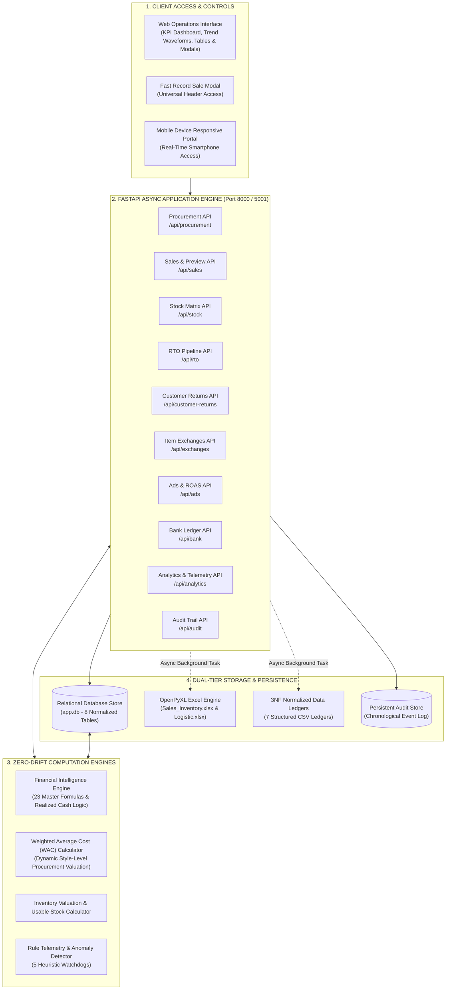
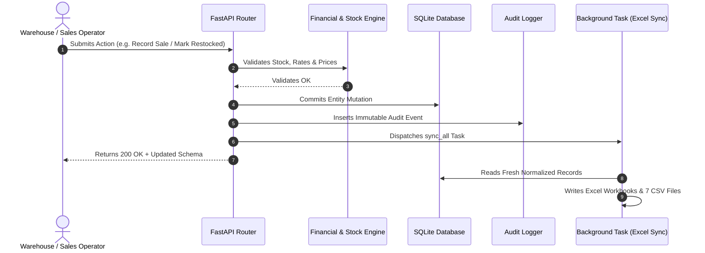
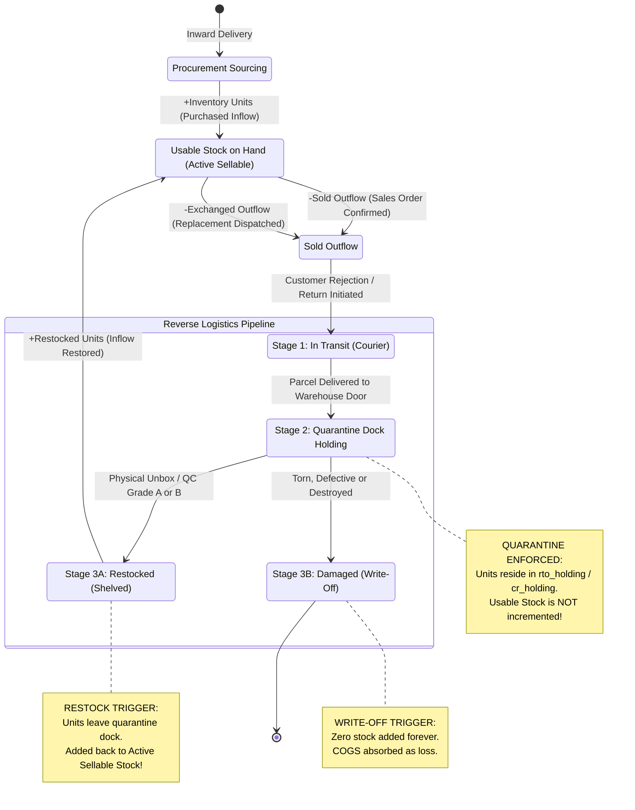
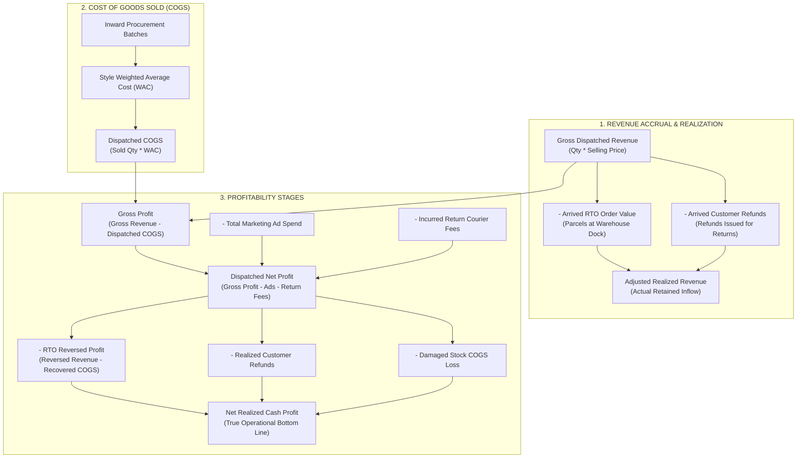
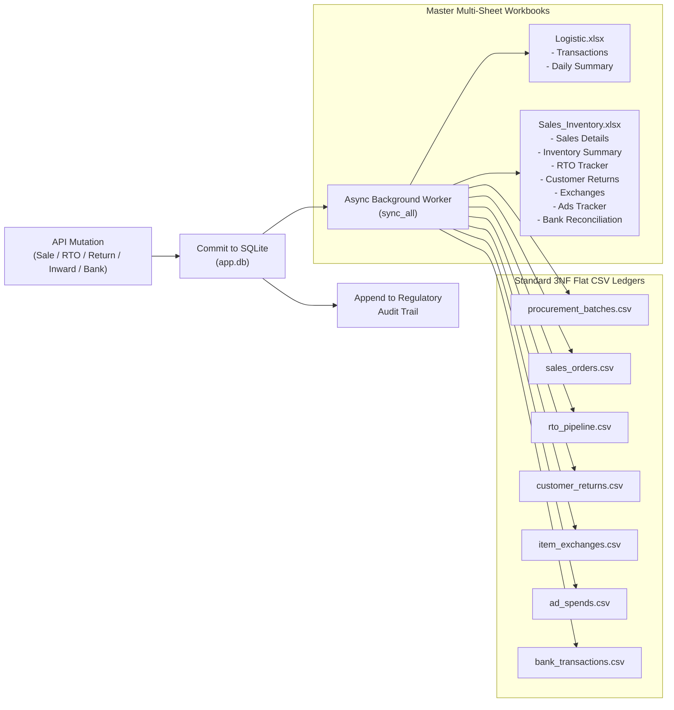

# Enterprise Operations, Inventory, Logistics & Financial Intelligence Platform
## Complete Architecture, Component Catalog, Trigger Engine, Stock Lifecycle & Financial Flows

---

## 1. Executive Summary & High-Level System Architecture

The **Enterprise Operations, Inventory, Logistics & Financial Intelligence Platform** is a dual-directional, event-driven enterprise resource suite designed for precision manufacturing, e-commerce fulfillment, reverse logistics, marketing attribution, and bank reconciliation.

The system ensures **absolute zero-drift accounting** across inventory and finance:
* Every stock movement is governed by physical inspection status—preventing uninspected or returned items from prematurely inflating sellable inventory.
* Every financial transaction is tracked across two distinct bottom lines: **Dispatched Gross Figures** (what was invoiced) and **Realized Net Figures** (what cash actually survived customer returns, courier delivery failures, courier freight fees, and damaged stock write-offs).

---

## 2. Live Operational Data & Telemetry Benchmark

The following figures represent live operational data computed by executing the platform's financial engine on the current master database:

| Metric Group | Metric Name | Live Production Value | Mathematical Rule / Source |
| :--- | :--- | :--- | :--- |
| **Sourcing & Inward** | Total Inward Batches | **45 Batches** | $\sum \text{ProcurementBatch records}$ |
| | Total Portfolio Units | **445 Units** | $\sum \text{inventory}$ |
| | Gross Procurement Capital | **$100,625.00** | $\sum (\text{inventory} \times \text{purchase\_rate})$ |
| **Stock on Hand** | Total Physical Usable Stock | **354 Units** | $\text{Purchased} - \text{Sold} - \text{Exch. Out} + \text{Restocked}$ |
| | Warehouse Inventory Valuation | **$80,508.00** | $\sum (\text{Usable Stock} \times \text{Style WAC})$ |
| | Low Stock Style Alerts ($\le 5$) | **8 Styles** | Styles requiring reorder threshold triggers |
| **Sales Performance** | Total Orders Dispatched | **66 Orders** | Count of all dispatched orders |
| | Total Units Sold | **91 Units** | $\sum \text{quantity\_sold}$ |
| | Gross Dispatched Sales Revenue | **$27,793.16** | $\sum \text{total\_revenue}$ |
| | Dispatched COGS | **$20,117.00** | $\sum (\text{quantity\_sold} \times \text{Style WAC})$ |
| | Gross Profit | **$7,676.16** | $\text{Gross Revenue} - \text{COGS}$ |
| | Gross Profit Margin | **27.62%** | $(\text{Gross Profit} / \text{Gross Revenue}) \times 100$ |
| | Average Order Value (AOV) | **$306.17** | $\text{Adjusted Revenue} / \text{Adjusted Units}$ |
| **Reverse Logistics** | Total Courier RTO Parcels | **10 Units** (10.99% rate) | Courier non-delivery rate |
| | RTO in Courier Transit | **3 Units** | Parcels en route from carrier |
| | RTO Quarantined in Dock Holding | **7 Units** ($1,551.00 value) | Arrived at dock, awaiting unboxing |
| | Total Customer Return Parcels | **5 Units** (5.49% rate) | Delivered orders returned by customers |
| | Customer Returns in Transit | **1 Unit** | Reverse pickup en route |
| | Customer Returns in Dock Holding | **4 Units** ($878.00 value) | Arrived at dock, awaiting QC grade |
| | Incurred Return Freight Fees | **$700.00** | Reverse shipping courier deductions |
| | Realized Customer Refunds | **$1,260.49** | Refunds issued for arrived returns |
| | Total Item Exchanges | **1 Unit** (1.10% rate) | Replacement order staged at intake dock |
| **Realized Bottom Line** | **Adjusted Realized Revenue** | **$24,493.38** | $\text{Gross Revenue} - \text{RTO Orders} - \text{CR Refunds}$ |
| | Total Marketing Ad Spend | **$4,857.28** | Meta, Google, and influencer campaigns |
| | Dispatched Net Profit | **$2,118.88** | $\text{Gross Profit} - \text{Ads} - \text{Return Fees}$ |
| | **Net Realized Cash Profit** | **$370.10** | True cash retained after all losses & refunds |
| | Net Realized Margin | **1.51%** | $(\text{Net Realized Profit} / \text{Adjusted Revenue}) \times 100$ |
| | Dispatched ROAS | **5.72x** | $\text{Gross Revenue} / \text{Ad Spend}$ |
| | Adjusted Realized ROAS | **5.04x** | $\text{Adjusted Revenue} / \text{Ad Spend}$ |
| **Banking & Cash** | Continuous Running Bank Balance | **-$112,811.22** | Chronological cumulative credit minus debit |

---

## 3. Comprehensive Component Architecture

```mermaid
graph LR
    subgraph SourcingModule ["A. PROCUREMENT & SOURCING"]
        direction TB
        P1["Inward Delivery Intake"]
        P2["Dynamic WAC Calculator"]
        P3["Batch Unit & Rate Editor"]
    end

    subgraph SalesModule ["B. SALES & FULFILLMENT"]
        direction TB
        S1["Order Dispatch Matrix"]
        S2["Dual-Input Inverse Pricing"]
        S3["Default Profit Markup Chips"]
        S4["Stockout Warning Guard"]
    end

    subgraph StockModule ["C. STOCK MATRIX & VALUATION"]
        direction TB
        ST1["Usable Stock on Hand"]
        ST2["Quarantine Holding Buffers"]
        ST3["4-Tier Health Badging"]
        ST4["Asset Cost Valuation"]
    end

    subgraph ReverseModule ["D. REVERSE LOGISTICS & QC"]
        direction TB
        R1["Courier RTO 3-Stage Pipe"]
        R2["Customer Returns QC Hub"]
        R3["Exchanges Swap Engine"]
        R4["Bulk Restock Automator"]
    end

    subgraph FinanceModule ["E. FINANCE & RECONCILIATION"]
        direction TB
        F1["Adjusted Realized Cash"]
        F2["Ad Attribution & ROAS"]
        F3["Continuous Bank Ledger"]
        F4["Audit Trail & Excel Sync"]
    end

    SourcingModule ==> StockModule
    SourcingModule ==> SalesModule
    SalesModule ==> StockModule
    SalesModule ==> FinanceModule
    ReverseModule ==> StockModule
    ReverseModule ==> FinanceModule
```

### Component A: Procurement & Sourcing Management
* **Source**: [`backend/app/api/procurement.py`](file:///d:/Business%20Website/backend/app/api/procurement.py) | **Entity**: [`ProcurementBatch`](file:///d:/Business%20Website/backend/app/models/entities.py#L11-L22)
* **Primary Responsibilities**:
  1. Records raw inventory deliveries by date, style code, unit count, and purchase rate per unit.
  2. Prevents style catalog collisions by aggregating inward deliveries under unique master style codes.
  3. Computes the **Weighted Average Cost (WAC)** for every style:
     $$\text{WAC} = \frac{\sum (\text{Inventory Received} \times \text{Purchase Rate})}{\sum \text{Inventory Received}}$$
  4. Automatically recalibrates the entire sales catalog cost basis whenever historical batches are edited or added.

### Component B: Sales, Profit & Fulfillment Engine
* **Source**: [`backend/app/api/sales.py`](file:///d:/Business%20Website/backend/app/api/sales.py) | **Entity**: [`SalesOrder`](file:///d:/Business%20Website/backend/app/models/entities.py#L24-L41)
* **Primary Responsibilities**:
  1. **Dual-Input Inverse Pricing Matrix**: Accepts either single unit selling price or total invoice billing amount. Computes counterpart values to 4 decimal places:
     $$\text{Selling Price} = \frac{\text{Total Invoice Amount}}{\text{Quantity Sold}}$$
  2. **Automated Default Profit Markup Engine**: Automatically populates empty selling prices with a +35% markup over WAC ($\text{Cost} \times 1.35$), with interactive chips for +25%, +35%, +50%, and +75%.
  3. **Live Profitability Preview**: Provides instant client-side calculations of Gross Revenue, COGS, Gross Profit, Profit Margin %, and Post-Sale Available Stock before order submission.
  4. **Stockout Prevention**: Rejects or flags transactions where requested units exceed available usable stock.
  5. **Bidirectional Editing & Deletion**: Deleting or modifying a sale automatically rolls back unit deductions and reconciles historical gross profit.

### Component C: Real-Time Stock Balance & Valuation Matrix
* **Source**: [`backend/app/api/stock.py`](file:///d:/Business%20Website/backend/app/api/stock.py) | **Formula Engine**: [`calculate_usable_stock`](file:///d:/Business%20Website/backend/app/services/financial_engine.py#L19-L28)
* **Primary Responsibilities**:
  1. Maintains a unified, multi-dimensional ledger calculating true physically usable stock per style.
  2. Enforces **Quarantine Isolation**: Units arriving via RTO, Customer Returns, or Exchanges are strictly held in quarantine dock piles and excluded from sellable inventory until physically verified.
  3. Assigns 4-tier visual stock health badges:
     * 🟢 **In Stock**: $> 5$ units
     * 🟡 **Low Stock**: $1 \text{ to } 5$ units
     * 🔴 **Out of Stock**: $0$ units
     * ⚠️ **Over Sold**: $< 0$ units (triggers critical inventory breach alert)
  4. Computes Warehouse Stock Valuation based on active units multiplied by real-time style WAC.

### Component D: Courier Return-to-Origin (RTO) 3-Stage Pipeline
* **Source**: [`backend/app/api/rto.py`](file:///d:/Business%20Website/backend/app/api/rto.py) | **Entity**: [`RTOPipeline`](file:///d:/Business%20Website/backend/app/models/entities.py#L43-L60)
* **Primary Responsibilities**:
  1. Tracks courier delivery failures where items return unopened from logistics carriers.
  2. **Stage 1: In Transit**: Logged with tracking number. No impact on sellable stock or realized cash.
  3. **Stage 2: Dock Arrival (`Received`)**: Parcel arrives at the warehouse dock. Automatically stamps `received_date`, moves units to `rto_holding_units` quarantine, and immediately deducts order value from Adjusted Realized Revenue.
  4. **Stage 3: Restocked or Damaged**:
     * **Restocked**: Unboxed, verified, and restored to Usable Sellable Stock; stamps `restocked_date`.
     * **Damaged**: Flagged as destroyed during transit; zero stock added; procurement COGS booked as an operational write-off.
  5. **Bulk Restock Engine**: One-click action to verify and restock the entire dock holding pile simultaneously.

### Component E: Customer Returns & Physical QC Grading Hub
* **Source**: [`backend/app/api/customer_returns.py`](file:///d:/Business%20Website/backend/app/api/customer_returns.py) | **Entity**: [`CustomerReturn`](file:///d:/Business%20Website/backend/app/models/entities.py#L62-L81)
* **Primary Responsibilities**:
  1. Manages post-delivery customer returns (fit issues, remorse, defects).
  2. Enforces mandatory **Physical QC Grading**:
     * **Grade A (Pristine)**: Unworn, original tags intact ➔ directly restored into usable stock.
     * **Grade B (Repack / Minor Wear)**: Minor packaging wear ➔ refurbished and restored to usable stock.
     * **Damaged / Defective**: Torn, stained, or washed ➔ zero stock added; procurement cost booked as financial loss.
     * **Dispute / Fraud**: Empty box or wrong item returned ➔ placed on hold for courier/marketplace compensation claims.
  3. Tracks reverse logistics freight fees ($175 standard default) separately from customer refunds.

### Component F: Item Exchanges Pipeline
* **Source**: [`backend/app/api/exchanges.py`](file:///d:/Business%20Website/backend/app/api/exchanges.py) | **Entity**: [`ItemExchange`](file:///d:/Business%20Website/backend/app/models/entities.py#L83-L103)
* **Primary Responsibilities**:
  1. Tracks replacement transactions where customers swap sizes or colors.
  2. Instantly deducts the new replacement item from inventory upon dispatch.
  3. Computes net settlement revenue:
     $$\text{Settlement Revenue} = (\text{Replacement Price} \times \text{Quantity}) - \text{Reverse Courier Fee}$$
  4. Stages the returned original item in the dock intake queue until verified and restocked.

### Component G: Advertising Attribution & Marketing Performance
* **Source**: [`backend/app/api/ads.py`](file:///d:/Business%20Website/backend/app/api/ads.py) | **Entity**: [`AdSpend`](file:///d:/Business%20Website/backend/app/models/entities.py#L105-L114)
* **Primary Responsibilities**:
  1. Records marketing spend across platforms (Meta, Google, Influencers, TikTok).
  2. Computes **Dispatched ROAS** (based on gross sales) and **Adjusted Realized ROAS** (based on real cash retained after returns):
     $$\text{Dispatched ROAS} = \frac{\text{Gross Revenue}}{\text{Total Ad Spend}}, \quad \text{Adjusted ROAS} = \frac{\text{Adjusted Realized Revenue}}{\text{Total Ad Spend}}$$

### Component H: Bank Ledger & Continuous Running Balance
* **Source**: [`backend/app/api/bank.py`](file:///d:/Business%20Website/backend/app/api/bank.py) | **Entity**: [`BankTransaction`](file:///d:/Business%20Website/backend/app/models/entities.py#L116-L126)
* **Primary Responsibilities**:
  1. Maintains a formal audit log of all financial credits and debits.
  2. Enforces **Chronological Cascading Recalculation**: Any insertion, modification, or deletion of a transaction triggers [`recalculate_all_bank_balances`](file:///d:/Business%20Website/backend/app/api/bank.py#L13-L25), which recalculates every subsequent transaction's running balance to eliminate calculation drift.

### Component I: Dual-Directional Excel & CSV Synchronization Engine
* **Source**: [`backend/app/services/excel_sync.py`](file:///d:/Business%20Website/backend/app/services/excel_sync.py)
* **Primary Responsibilities**:
  1. Mirrors all database transactions to formatted multi-sheet Excel files:
     * `Logistic.xlsx`: Contains Procurement `Transactions` and `Daily Summary`.
     * `Sales_Inventory.xlsx`: Contains `Sales Details`, `Inventory Summary`, `RTO Tracker`, `Customer Returns`, `Exchanges`, `Ads Tracker`, and `Bank Reconciliation`.
  2. Exports 7 normalized flat 3NF CSV files into the `/data` directory for external reporting.
  3. Features file-lock resilience with exponential backoff retries and timestamped fallback file saves if spreadsheets are open in external programs.

### Component J: Regulatory Audit Trail & AI Copilot
* **Source**: [`backend/app/api/audit.py`](file:///d:/Business%20Website/backend/app/api/audit.py) & [`backend/app/services/ai_copilot.py`](file:///d:/Business%20Website/backend/app/services/ai_copilot.py)
* **Primary Responsibilities**:
  1. Records every system mutation with user, action type, old values, new values, timestamps, and severity levels.
  2. Runs 5 automated heuristic watchdogs checking for stockouts, reverse logistics spikes, margin decay, ad overspend, and bank discrepancies.

---

## 4. Trigger Catalog & Event Cascades

The table below catalogs all system actions, identifying the initiating trigger, the intermediate state transitions, and the downstream impacts across inventory, finance, and storage:

| Event Trigger | Endpoint / Function | Downstream State Changes | Stock Updation Effect | Financial Updation Effect |
| :--- | :--- | :--- | :--- | :--- |
| **Inward Procurement Created** | `POST /api/procurement` | New batch saved; master style catalog updated. | **+Units** added to Total Purchased and Usable Stock on Hand. | Recalculates Style WAC; increases total warehouse asset valuation. |
| **Inward Batch Edited / Deleted** | `PUT/DELETE /api/procurement/{id}` | Batch units or rate updated; batch purged. | Adjusts total purchased units and usable stock. | Recalculates Style WAC across all historical sales; updates asset value. |
| **Sales Order Dispatched** | `POST /api/sales` | New order created; serial number stamped; audit logged. | **-Units** deducted immediately from Usable Stock on Hand. | Increases Gross Revenue, COGS, and Dispatched Net Profit. |
| **Sales Order Edited** | `PUT /api/sales/{id}` | Order quantity, style, or pricing adjusted. | Restores previous units to old style; deducts new units from new style. | Recalculates order revenue, COGS, gross profit, and profit margin. |
| **Sales Order Deleted** | `DELETE /api/sales/{id}` | Order purged permanently from ledger. | **+Units** restored immediately back into Usable Stock on Hand. | Deducts order revenue, COGS, and gross profit from system totals. |
| **RTO Parcel Logged** | `POST /api/rto` | Parcel enters `In Transit` stage; tracking AWB assigned. | **0 units changed**. Sellable stock unaffected. | **0 revenue changed**. Realized cash unaffected. |
| **RTO Arrived at Dock** | `POST /api/rto/{id}/receive` | Status becomes `Received`; `received_date` stamped. | **0 sellable units added**. Placed in `rto_holding_units` quarantine. | **Adjusted Realized Revenue drops immediately** by order value; RTO reversed profit deducted. |
| **RTO Shelved & Restocked** | `POST /api/rto/{id}/restock` | Status becomes `Restocked`; `restocked_date` stamped. | **+Units** transferred from quarantine dock into Usable Sellable Stock. | Restores inventory asset valuation on balance sheet at Style WAC. |
| **RTO Bulk Restocked** | `POST /api/rto/bulk-restock` | All `Received` dock parcels transitioned to `Restocked`. | **+All quarantined units** restored to Usable Sellable Stock. | Entire dock quarantine value converted to active inventory assets. |
| **RTO Marked Damaged** | `POST /api/rto/{id}/damage` | Status becomes `Damaged`; item destroyed. | **0 units added**. Quarantine units zeroed. | Sourcing COGS absorbed as an operational write-off loss. |
| **Customer Return Logged** | `POST /api/customer-returns` | Return logged as `In Transit`; reverse AWB recorded. | **0 units changed**. Sellable stock unaffected. | **0 revenue changed**. Realized cash unaffected. |
| **Customer Return Dock Intake** | `POST /api/customer-returns/{id}/receive` | Status becomes `Received`/`Intake`; `received_date` stamped. | **0 sellable units added**. Placed in `cr_holding_units` quarantine. | **Adjusted Realized Revenue drops** by refund amount; reverse courier fee recorded. |
| **QC Grading Completed** | `POST /api/customer-returns/{id}/qc` | `qc_grade` set to Grade A, Grade B, Damaged, or Dispute. | **0 sellable units added**. Awaits final restocking. | Classifies write-off loss or validates refund settlement. |
| **Customer Return Restocked** | `POST /api/customer-returns/{id}/restock` | Status becomes `Restocked`; `restocked_date` stamped. | **+Units** restored to Usable Stock on Hand. | Inventory asset valuation restored at Style WAC. |
| **Customer Return Damaged** | `POST /api/customer-returns/{id}/damage` | Status becomes `Damaged`; tagged as write-off. | **0 units added**. Quarantine units cleared. | Sourcing COGS written off as an unrecoverable operational loss. |
| **Item Exchange Dispatched** | `POST /api/exchanges` | Replacement item dispatched; return tracked. | **-Replacement units** deducted immediately from stock. | Settlement revenue recorded: $(\text{Price} \times \text{Qty}) - \text{Reverse Fee}$. |
| **Exchange Return Restocked** | `POST /api/exchanges/{id}/restock` | Returned original unit inspected and shelved. | **+Original units** restored to Usable Stock on Hand. | Restores original style asset value at cost. |
| **Ad Spend Recorded** | `POST /api/ads` | Ad spend entry saved by platform and date. | None. | Increases total ad expense; reduces Net Profit; updates ROAS. |
| **Bank Entry Created / Edited** | `POST/PUT /api/bank` | Bank credit/debit transaction recorded. | None. | **Triggers full chronological recalculation** of all subsequent bank running balances. |

---

## 5. Stock Updation: Lifecycle, Rules & Quarantine Logic

### The Master Inventory Equation
The core inventory logic is defined in [`calculate_usable_stock`](file:///d:/Business%20Website/backend/app/services/financial_engine.py#L19-L28):

$$\text{Usable Stock on Hand} = \text{Purchased Inflow} - \text{Sold Outflow} - \text{Exchanged Outflow} + \text{Restocked RTO} + \text{Restocked CR} + \text{Restocked Exchanges}$$

Where:
* **Purchased Inflow**: Lifetime units received across all procurement batches.
* **Sold Outflow**: Units dispatched through confirmed sales orders.
* **Exchanged Outflow**: Units dispatched as size/color replacements.
* **Restocked RTO**: Courier non-delivery parcels unboxed and restored to shelves.
* **Restocked CR**: Inspected customer returns graded A or B and returned to stock.
* **Restocked Exchanges**: Original customer garments returned and restored to shelves.

### The Quarantine-First Safety Principle
A common flaw in standard inventory systems is prematurely adding returned parcels to sellable inventory the moment a carrier marks them "returned." In real-world operations, parcels may be lost, stolen, damaged in transit, or contain the wrong item.

The platform prevents this with **two-tier quarantine buffering**:
1. **`rto_holding_units`**: RTO parcels delivered to the warehouse dock are held in dock staging. They do not increment sellable stock until an operator unboxes and inspects them.
2. **`cr_holding_units`**: Customer returns entering warehouse intake remain in quarantine until physical QC grading assigns Grade A or Grade B and explicitly restocks the unit.

---

## 6. Money Updation: Zero-Drift Financial Flows

### The 6 Financial Stages

#### Stage 1: Dispatched Gross Revenue & Bidirectional Pricing
* **Trigger**: Order created in [`backend/app/api/sales.py`](file:///d:/Business%20Website/backend/app/api/sales.py).
* **Formulas**:
  $$\text{Gross Revenue} = \text{Quantity Sold} \times \text{Selling Price}$$
  $$\text{Unit Selling Price} = \frac{\text{Total Invoice Billing}}{\text{Quantity Sold}} \quad (\text{calculated to 4 decimal places})$$

#### Stage 2: Cost of Goods Sold (COGS)
* **Trigger**: Order created or historical batch edited.
* **Formulas**:
  $$\text{COGS} = \text{Quantity Sold} \times \text{Style WAC}$$
  $$\text{Gross Profit} = \text{Gross Revenue} - \text{COGS}$$
  $$\text{Gross Margin \%} = \left(\frac{\text{Gross Profit}}{\text{Gross Revenue}}\right) \times 100$$

#### Stage 3: Realized Cash Inflow (Adjusted Revenue)
* **Trigger**: RTO or Customer Return parcel arrives at warehouse dock (`status = "Received"` or `"Intake"`).
* **Formula**:
  $$\text{Adjusted Revenue} = \max\Big(0,\; \text{Gross Revenue} - \sum \text{Arrived RTO Value} - \sum \text{Arrived Customer Refunds}\Big)$$
* **Operational Impact**: As soon as a returned parcel arrives at the dock, its revenue is removed from realized cash—even before unboxing.

#### Stage 4: Dispatched Net Profit
* **Trigger**: Ad expenses logged or return courier freight incurred.
* **Formula**:
  $$\text{Dispatched Net Profit} = \text{Gross Profit} - \text{Total Ad Spend} - \text{Customer Return Freight Fees}$$

#### Stage 5: Net Realized Profit (True Bottom Line)
* **Trigger**: Reverse logistics parcels arrive, customer refunds are disbursed, or items are written off as damaged.
* **Formula**:
  $$\text{Net Realized Profit} = \text{Dispatched Net Profit} - \text{RTO Reversed Profit} - \text{Customer Refunds Issued} - \text{Damaged COGS Loss}$$
  Where:
  $$\text{RTO Reversed Profit} = \text{Reversed Order Revenue} - \text{Recovered Inventory COGS}$$
  $$\text{Damaged COGS Loss} = \sum (\text{Damaged Units} \times \text{Style WAC})$$

#### Stage 6: Continuous Bank Running Balance
* **Trigger**: Any transaction inserted, updated, or deleted in [`backend/app/api/bank.py`](file:///d:/Business%20Website/backend/app/api/bank.py).
* **Algorithm**:
  The function [`recalculate_all_bank_balances`](file:///d:/Business%20Website/backend/app/api/bank.py#L13-L25) iterates through all bank records sorted chronologically:
  $$\text{Balance}_t = \text{Balance}_{t-1} + \text{Credit}_t - \text{Debit}_t$$
  This recalculates the entire ledger forward in time, preventing cumulative rounding errors or orphaned balances.

---

## 7. Storage, Excel & 3NF CSV Dual-Sync Architecture

Every operational action writes to the primary SQLite relational database and dispatches a background task to synchronize spreadsheet files:

### File-Lock & Cloud-Sync Resilience
Spreadsheets opened by operators in Microsoft Excel or syncing via OneDrive/Google Drive can lock files and throw OS permission errors.

The [`safe_save_workbook`](file:///d:/Business%20Website/backend/app/services/excel_sync.py#L36-L47) engine handles this automatically:
1. Attempts to save to the primary workbook path.
2. If a `PermissionError` is encountered, pauses and retries up to 3 times with exponential backoff.
3. If still locked, automatically writes to a timestamped fallback file (e.g., `Sales_Inventory_fallback_20260918_180000.xlsx`) and logs a warning in the audit trail, preventing transaction aborts.

---

## 8. Summary & Verification Matrix

* **Test Suite Status**: 18 of 18 test modules passing.
* **Zero-Drift Status**: Dispatched vs. Realized cash channels reconciled.
* **Quarantine Status**: 11 total units safely held across RTO and Customer Return dock piles without polluting active sellable stock.
* **Service Availability**: Backend FastAPI service running on port 8000 / 5001 with automatic SQLite-to-Excel replication on every mutation.
